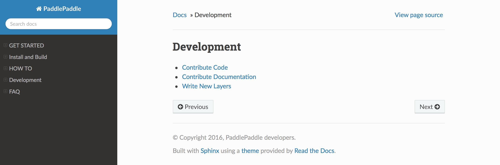

########################
Contribute Documentation
########################

PaddlePaddle supports English documentation ``doc`` and Chinese documentation ``doc_cn``.
Both are compiled by `cmake`_ and `sphinx`_ , the compiled documentations will be stored under ``doc`` and ``doc_cn`` directories.
When using the PaddlePaddle.org to compile documentations, the compiled documentations will be stored under a consolidated directory: .ppo_workspace/content

How to Build Documentations
============

We recommend using PaddlePaddle.org tool to build documentation

Use PaddlePaddle.org tool
--------------
This is the recommended method to build documentation. It can compile documentation and preview the documentation in a web browser.

The tool uses Docker, please install it on your system. Please check Docker official website on how to install Docker. You may use the following commands to activate the tool

..  code-block:: bash

    mkdir paddlepaddle # Create paddlepaddle working directory
    cd paddlepaddle

    # Clone the content repositories. You may only clone the contents you need
    git clone https://github.com/PaddlePaddle/Paddle.git
    git clone https://github.com/PaddlePaddle/book.git
    git clone https://github.com/PaddlePaddle/models.git
    git clone https://github.com/PaddlePaddle/Mobile.git

    # Please specify the working directory through -v
    docker run -it -p 8000:8000 -v `pwd`:/var/content paddlepaddle/paddlepaddle.org:latest

Note: PaddlePaddle.org will read the content repos specified in the -v (volume) flag of the docker run command
Use a web browser and navigate to http://localhost:8000, click the buttons to compile the documentation
The compiled documentations will be stored in <paddlepaddle working directory>/.ppo_workspace/content

If you don't wish to use Docker, you can also activate the tool through Django. Use the following the commands to set up

..  code-block:: bash

    mkdir paddlepaddle # Create paddlepaddle working directory
    cd paddlepaddle

    # Clone the content repositories and PaddlePaddle.org
    git clone https://github.com/PaddlePaddle/Paddle.git
    git clone https://github.com/PaddlePaddle/book.git
    git clone https://github.com/PaddlePaddle/models.git
    git clone https://github.com/PaddlePaddle/Mobile.git
    git clone https://github.com/PaddlePaddle/PaddlePaddle.org.git

    # Please specify the PaddlePaddle working directory. In the current setting, it should be pwd
    export CONTENT_DIR=<path_to_paddlepaddle_working_directory>
    export ENV=''
    cd PaddlePaddle.org/portal/
    pip install -r requirements.txt
    python manage.py runserver

Use a web browser and navigate to http://localhost:8000, click the buttons to compile the documentation
The compiled documentations will be stored in <paddlepaddle working directory>/.ppo_workspace/content

If you want to learn more on the PaddlePaddle.org, please `click here <https://github.com/PaddlePaddle/PaddlePaddle.org/blob/develop/README.md>`_ 。

build documentations directly
----------------------------

There's two ways to build documentations directly: build documents and build APIs

- build documents

If you only need to build documents, you can execute the following command to set up:

.. code-block:: bash

   make -j $processors gen_proto_py
   make -j $processors paddle_docs paddle_docs_cn

- build APIs

If you only need to build APIs, you can execute the following command to set up:

.. code-block:: bash

   make -j $processors gen_proto_py framework_py_proto
   make -j $processors copy_paddle_pybind
   make -j $processors paddle_api_docs

$processors represents how many processes are started for compilation. Generally, it can be set to 1, 4, or 8.

After the compilation is complete, enter the doc/v2 directory. Three subdirectories are generated under this directory. You can enter the directories cn/html/, en/html, and api/en/html respectively and execute the following commands:

.. code-block:: bash

   python -m SimpleHTTPServer 8088

Enter http://localhost:8088 in the browser to see the compiled Chinese/English documents page and the English APIs page. The following picture shows an example of a generated English document page.

How to write Documentations
============

PaddlePaddle uses `sphinx`_ to compile documentations，Please check sphinx official website for more detail.

How to update www.paddlepaddle.org
============================

Please create PRs and submit them to github, please check `Contribute Code <http://www.paddlepaddle.org/docs/develop/documentation/en/howto/dev/contribute_to_paddle_en.html>`_ 。
PaddlePaddle develop branch will update the documentation once the PR is merged. User may check latest `Chinese Docs <http://www.paddlepaddle.org/docs/develop/documentation/zh/getstarted/index_cn.html>`_ and
`English Docs <http://www.paddlepaddle.org/docs/develop/documentation/en/getstarted/index_en.html>`_ 。

..  _cmake: https://cmake.org/
..  _sphinx: http://www.sphinx-doc.org/en/1.4.8/
