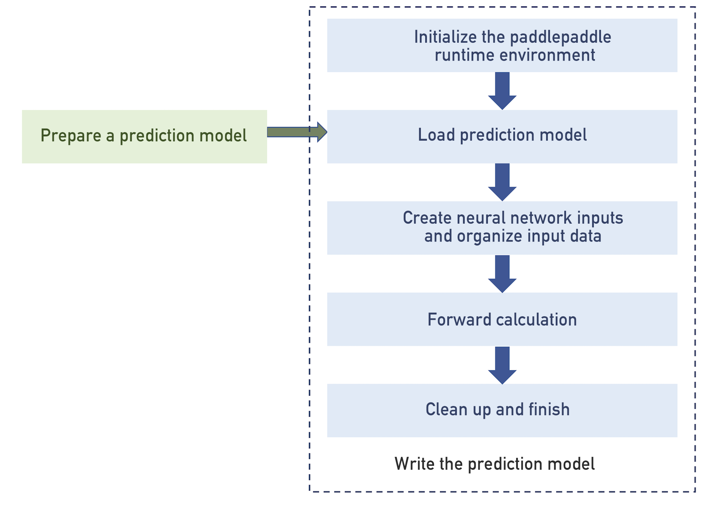

## C-API Workflow

This document introduce the overall use of the PaddlePaddle C-API.

### Use steps

The workflow of using the C-API is shown in Figure 1, and is divided into two parts: (1) preparation of a prediction model and (2) prediction program development.

<p align="center">
<br> Figure 1. Schematic diagram of C-API usage
</p>

- Prepare the predicted model

    1. Only serialize the neural network structure.
        - Only the neural network structure is serialized, and to load the model, the serialization result of the network structure and the model parameter storage directory must be specified at the same time.
    1. Merge the network structure definition and the end of the training stored model parameter file(s) into a single file.
        - The neural network model structure and the trained model will be serialized into one file.
        - Only one file needs to be loaded for predicting.
    - **note**：The above two methods only need to select one of them.
- Call C-API to develop prediction program

    1. Initialize the PaddlePaddle runtime environment.
    1. Load the prediction model.
    1. Create neural network inputs and organize the inputed data.
    1. Perform forward calculations to obtain the calculation results.
    1. Clean up and finish.

### Prepare the predicted model

To prepare the prediction model, we will introduce hand-written digital recognition tasks as an example.
The handwritten digital recognition task defines [a simple fully-connected network with two hidden layers](https://github.com/PaddlePaddle/book/blob/develop/02.recognize_digits/README.cn.md#softmax回归softmax-regression), The network accepts a picture as input and categorizes the picture into one of the 0 to 9 category labels. The full code can see the related scripts in [this directory](https://github.com/PaddlePaddle/Paddle/tree/develop/paddle/capi/examples/model_inference/dense).

Calling the C-API development prediction program requires a trained model, running the [mnist_v2.py](https://github.com/PaddlePaddle/Paddle/blob/develop/paddle/capi/examples/model_inference/dense/mnist_v2.py) script under the [MNIST Handwriting Digital Recognition Catalog](https://github.com/PaddlePaddle/Paddle/tree/develop/paddle/capi/examples/model_inference/dense), executing `python mnist_v2.py` on the terminal will use PaddlePaddle's built-in [MNIST dataset](http://yann.lecun.com/exdb/mnist/) for training. 训练好的模型默认保存在当前运行目录下的`models`目录中。

In the following, we convert the model stored after the training to the predicted model.

1. Serialized the configuration of neural network model 

    PaddlePaddle uses protobuf to transmit the network structure and related parameters defined in the network configuration file, when using the C-API for prediction, the network structure needs to be serialized using protobuf and written into the file.

    The `dump_v2_config` function in [`paddle.utils.dump_v2_config`](https://github.com/PaddlePaddle/Paddle/tree/develop/python/paddle/utils/dump_v2_config.py) can dump the neural network structure defined using the PaddlePaddle V2 API into the specified file. The sample code is as follows:

    ```python
    from paddle.utils.dump_v2_config import dump_v2_config
    from mnist_v2 import network

    predict = network(is_infer=True)
    dump_v2_config(predict, "trainer_config.bin", True)
    ```

    For the example of [Handwriting Number Recognition] (https://github.com/PaddlePaddle/Paddle/tree/develop/paddle/capi/examples/model_inference/dense), [`mnist_v2.py`] (https://github. The com/PaddlePaddle/Paddle/tree/develop/paddle/capi/examples/model_inference/dense/mnist_v2.py) script integrates the process of serializing neural network structures and can directly run `python mnist_v2.py --task dump_config` to serialize the network structure and the result will be written to the `trainer_config.bin` file in the current run directory.

    In this way, **you need to place multiple learnable parameters of a neural network in the same directory at runtime**. The C-API can load the trained model by specifying the serialized network structure files and parameter directories respectively.

2. Merge model files (optional)

    In some cases for ease of releasing, it is expected to be able to package the serialized neural network structure and trained model parameters into a single file. For such a requirement, the neural network structure and the trained parameters can be serialized using the `merge_v2_model` interface in `paddle.utils.merge_model` to write the serialization result into a file.

    The code example is as follows:

    ```python
    from paddle.utils.merge_model import merge_v2_modelss
    from mnist_v2 import network

    net = network(is_infer=True)
    param_file = "models/params_pass_4.tar"
    output_file = "output.paddle.model"
    merge_v2_model(net, param_file, output_file)
    ```

    For the example of [handwriting number recognition](https://github.com/PaddlePaddle/Paddle/tree/develop/paddle/capi/examples/model_inference/dense), you can directly run `python` [merge_v2_model.py](https: //github.com/PaddlePaddle/Paddle/tree/develop/paddle/capi/examples/model_inference/dense/merge_v2_model.py). The serialization result will be written to the `output.paddle.model` file in the current run directory. In this way, the runtime C-API can load the prediction model by specifying the path to the `output.paddle.model` file.

#### Precautions
1. To use the C-API, the argument `binary` must be specified as `True` when calling the `dump_v2_config` serialized neural network structure.
1. **The network structure used for prediction is often different from training**. It usually needs to remove the network: (1) class label layer; (2) loss function layer; (3) `evaluator`, leaving only the core computing layer. Please pay attention to whether you need to modify the network structure.**
1. When predicting, you can obtain the result of forward calculation of any number (greater than or equal to one) defined in the network, add the layers which results of calculations are needed as output to a Python list as the first argument when call the function `dump_v2_config`.

### Write the prediction code

For more detailed examples of the prediction code, you can refer to the code examples in the [C-API Usage Example](https://github.com/PaddlePaddle/Paddle/tree/develop/paddle/capi/examples/model_inference) directory. This section introduce the five steps of the prediction code writing in Figure 1.

#### step 1. Initialize the PaddlePaddle runtime environment
The first step need to call [`paddle_init`](https://github.com/PaddlePaddle/Paddle/blob/develop/paddle/capi/main.h#L27) to initialize the PaddlePaddle runtime environment, the interface accepts two parameters: the number of parameters and the parameter list.

#### step 2. Load model

Here introduce an important concept when using the the C-API：Gradient Machine。

Conceptually, inside the PaddlePaddle, a GradientMachine object manages a set of PaddlePaddle Layers to perform forward and reverse calculations and handle all the details associated with it. When calling C-API to predict, only forward calculations are needed to be performed. The remaining of this document will use the `gradient machine` to specifically refer to the object of the GradientMachine class created by the PaddlePaddle C-API. Each `gradient machine` manages and maintains a trained model. Here are two commonly used methods for loading models provided by C-API:

1. Call the [`paddle_gradient_machine_load_parameter_from_disk`](https://github.com/PaddlePaddle/Paddle/blob/develop/paddle/capi/gradient_machine.h#L61) interface to load the prediction model from disk. At this time, the `gradient machine` will independently have a trained model;
1. Call the [`paddle_gradient_machine_create_shared_param`](https://github.com/PaddlePaddle/Paddle/blob/develop/paddle/capi/gradient_machine.h#L88) interface to share the loaded prediction model with other `gradient machine`. This situation is mostly seen when using multi-threaded prediction to reduce memory overhead by sharing the same model across multiple threads. See [this example](https://github.com/PaddlePaddle/Paddle/blob/develop/paddle/capi/examples/model_inference/multi_thread/main.c).

- Precautions

    1. When using PaddlePaddle V2 API to train, all the learnable parameters in the model will be saved as a compressed file. You need to manually decompress them and place them in the same directory. The C-API will not directly load the compressed files stored by the V2 API.
    1. If you use the way of `merge model` to serialize neural network structures and trained parameters into a file, refer to this [example] (https://github.com/PaddlePaddle/Mobile/blob/develop/Demo/linux/paddle_image_recognizer .cpp#L59).
    1. By using the above two interfaces flexibly, there are many other ways to load the model. For example, another model can be loaded during program execution.

#### step 3. Create neural network inputs, organize input data

Basic concepts of usage:
- Inside the PaddlePaddle, the inputs and outputs of a computational layer in a neural network are organized into an `Argument` structure. If the neural network has multiple inputs or multiple outputs, each input/output will have its own `Argument`.
- The `Argument` does not really "store" data, but instead organizes input/output data organically.
- Inside the `Argument` consists of: 1. `Matrix` (two-dimensional matrix, storing floating-point type input/output); 2. `IVector` (one-dimensional array, **is only used to store integer value**, mostly used Natural language processing tasks) to actually store data.

For all input data types supported by the C-API and how they are organized, please refer to the section "Input/Output Data Organization".

The latter part of this document will use `argument` to specifically refer to an input/output of a neural network in the PaddlePaddle C-API. Use `paddle_matrix` to **refer specifically** to objects of the `Matrix` class used to store data in `argument`.

When you organize the inputs of neural network and to obtain the outputs, you need to think about completing the following tasks:

1. Create `argument` for each input/output;
1. Create `paddle_matrix` for each `argument` to store data;

Unlike input, there is no need to allocate space for the paddle_matrix object of the outputs `argument` when using the C-API. PaddlePaddle has allocated/managed the storage space of each computing layer internally after the forward calculation.

#### step 4. Forward calculation

After completing the above preparation, the forward calculation of the neural network is completed by calling the [`paddle_gradient_machine_forward`](https://github.com/PaddlePaddle/Paddle/blob/develop/paddle/capi/gradient_machine.h#L73) interface.

#### step 5. Clean

After the prediction is finished, the used intermediate variables and resources are cleaned up and released.


