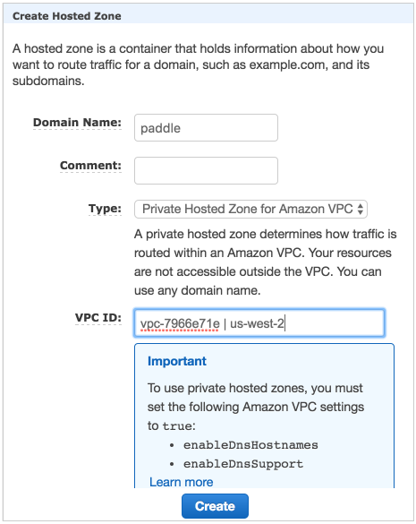
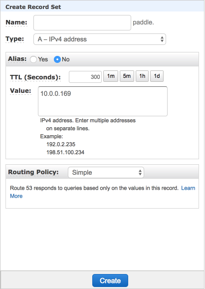
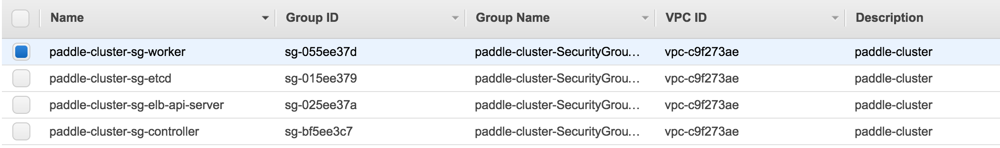
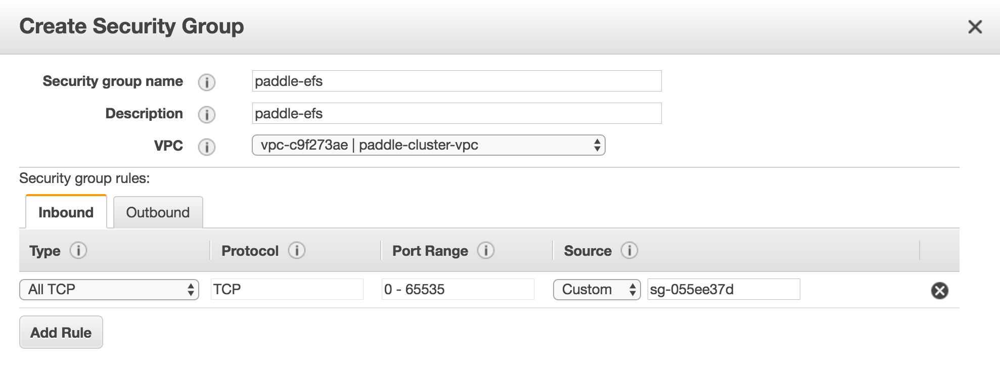
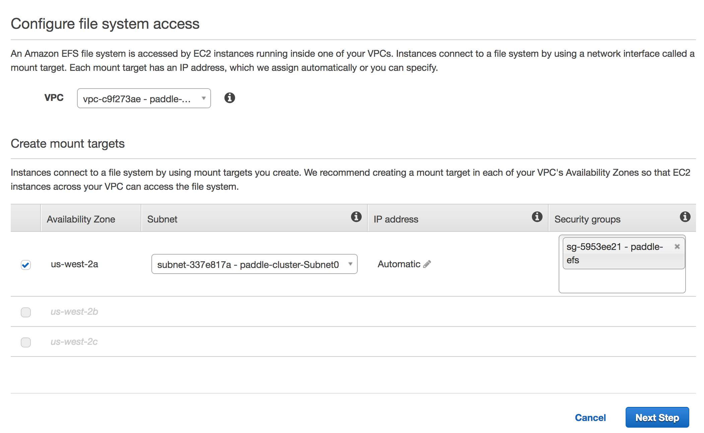

# Kubernetes on AWS

We will show you step by step on how to run distributed PaddlePaddle training on AWS cluster with Kubernetes. Let's start from core concepts.

## Distributed PaddlePaddle Training Core Concepts

### Distributed Training Job

A distributed training job is represented by a [Kubernetes job](https://kubernetes.io/docs/user-guide/jobs/#what-is-a-job).

Each Kuberentes job is described by a job config file, which specifies the information like the number of [pods](https://kubernetes.io/docs/user-guide/pods/#what-is-a-pod) in the job and environment variables.

In a distributed training job, we would:

1. prepare partitioned training data and configuration file on a distributed file system (in this tutorial we use Amazon Elastic File System), and
1. create and submit the Kubernetes job config to the Kubernetes cluster to start the training job.

### Parameter Servers and Trainers

There are two roles in a PaddlePaddle cluster: *parameter server (pserver)* and *trainer*. Each parameter server process maintains a shard of the global model. Each trainer has its local copy of the model, and uses its local data to update the model. During the training process, trainers send model updates to parameter servers, parameter servers are responsible for aggregating these updates, so that trainers can synchronize their local copy with the global model.

<center></center>

In order to communicate with pserver, trainer needs to know the ip address of each pserver. In kubernetes it's better to use a service discovery mechanism (e.g., DNS hostname) rather than static ip address, since any pserver's pod may be killed and a new pod could be schduled onto another node of different ip address. However, now we are using static ip. This will be improved.

Parameter server and trainer are packaged into a same docker image. They will run once pod is scheduled by kubernetes job.

### Trainer ID

Each trainer process requires a trainer ID, a zero-based index value, passed in as a command-line parameter. The trainer process thus reads the data partition indexed by this ID.

### Training

The entry-point of a container is a shell script. It can see some environment variables pre-defined by Kubernetes. This includes one that gives the job's identity, which can be used in a remote call to the Kubernetes apiserver that lists all pods in the job.

We rank each pod by sorting them by their ips. The rank of each pod could be the "pod ID". Because we run one trainer and one parameter server in each pod, we can use this "pod ID" as the trainer ID. A detailed workflow of the entry-point script is as follows:

1. Query the api server to get pod information, and assign the `trainer_id` by sorting the ip.
1. Copy the training data from EFS persistent volume into container.
1. Parse the `paddle pserver` and `paddle trainer` startup parameters from environment variables, and then start up the processes.
1. Trainer with `train_id` 0 will automatically write results onto EFS volume.


## PaddlePaddle on AWS with Kubernetes

### Choose AWS Service Region
This tutorial requires several AWS services work in the same region. Before we create anything in AWS, please check the following link
https://aws.amazon.com/about-aws/global-infrastructure/regional-product-services/
Choose a region which has the following services available: EC2, EFS, VPS, CloudFormation, KMS, VPC, S3.
In this tutorial, we use "Oregon(us-west-2)" as example.

### Create AWS Account and IAM Account

Under each AWS account, we can create multiple [IAM](http://docs.aws.amazon.com/IAM/latest/UserGuide/introduction.html) users. This allows us to grant some privileges to each IAM user and to create/operate AWS clusters as an IAM user.

To sign up an AWS account, please
follow
[this guide](http://docs.aws.amazon.com/lambda/latest/dg/setting-up.html).
To create IAM users and user groups under an AWS account, please
follow
[this guide](http://docs.aws.amazon.com/IAM/latest/UserGuide/id_users_create.html).

Please be aware that this tutorial needs the following privileges for the user in IAM:

- AmazonEC2FullAccess
- AmazonS3FullAccess
- AmazonRoute53FullAccess
- AmazonRoute53DomainsFullAccess
- AmazonElasticFileSystemFullAccess
- AmazonVPCFullAccess
- IAMUserSSHKeys
- IAMFullAccess
- NetworkAdministrator
- AWSKeyManagementServicePowerUser


### Download kube-aws and kubectl

#### kube-aws

[kube-aws](https://github.com/coreos/kube-aws) is a CLI tool to automate cluster deployment to AWS.
##### Verify kube-aws integrity
Note: if you are using a non-official release (e.g RC release) kube-aws, you can skip this setp.
Import the CoreOS Application Signing Public Key:

```
gpg2 --keyserver pgp.mit.edu --recv-key FC8A365E
```

Validate the key fingerprint:

```
gpg2 --fingerprint FC8A365E
```
The correct key fingerprint is `18AD 5014 C99E F7E3 BA5F 6CE9 50BD D3E0 FC8A 365E`

We can download `kube-aws` from its [release page](https://github.com/coreos/kube-aws/releases). In this tutorial, we use version 0.9.1

Validate the tarball's GPG signature:

```
PLATFORM=linux-amd64
 # Or
PLATFORM=darwin-amd64

gpg2 --verify kube-aws-${PLATFORM}.tar.gz.sig kube-aws-${PLATFORM}.tar.gz
```
##### Install kube-aws
Extract the binary:

```
tar zxvf kube-aws-${PLATFORM}.tar.gz
```

Add kube-aws to your path:

```
mv ${PLATFORM}/kube-aws /usr/local/bin
```


#### kubectl

[kubectl](https://kubernetes.io/docs/user-guide/kubectl-overview/) is a command line interface for running commands against Kubernetes clusters.

Download `kubectl` from the Kubernetes release artifact site with the `curl` tool.

```
# OS X
curl -O https://storage.googleapis.com/kubernetes-release/release/"$(curl -s https://storage.googleapis.com/kubernetes-release/release/stable.txt)"/bin/darwin/amd64/kubectl

# Linux
curl -O https://storage.googleapis.com/kubernetes-release/release/"$(curl -s https://storage.googleapis.com/kubernetes-release/release/stable.txt)"/bin/linux/amd64/kubectl
```

Make the kubectl binary executable and move it to your PATH (e.g. `/usr/local/bin`):

```
chmod +x ./kubectl
sudo mv ./kubectl /usr/local/bin/kubectl
```

### Configure AWS Credentials

First check out [this](http://docs.aws.amazon.com/cli/latest/userguide/installing.html) for installing the AWS command line interface.

And then configure your AWS account information:

```
aws configure
```


Fill in the required fields:


```
AWS Access Key ID: YOUR_ACCESS_KEY_ID
AWS Secrete Access Key: YOUR_SECRETE_ACCESS_KEY
Default region name: us-west-2
Default output format: json
```

`YOUR_ACCESS_KEY_ID`, and `YOUR_SECRETE_ACCESS_KEY` is the IAM key and secret from [Create AWS Account and IAM Account](#create-aws-account-and-iam-account)

Verify that your credentials work by describing any instances you may already have running on your account:

```
aws ec2 describe-instances
```

### Define Cluster Parameters

#### EC2 key pair

The keypair that will authenticate SSH access to your EC2 instances. The public half of this key pair will be configured on each CoreOS node.

Follow [EC2 Keypair User Guide](http://docs.aws.amazon.com/AWSEC2/latest/UserGuide/ec2-key-pairs.html) to create a EC2 key pair

After creating a key pair, you will use the key pair name to configure the cluster.

Key pairs are only available to EC2 instances in the same region. We are using us-west-2 in our tutorial, so make sure to creat key pairs in that region (Oregon).

Your browser will download a `key-name.pem` file which is the key to access the EC2 instances. We will use it later.


#### KMS key

Amazon KMS keys are used to encrypt and decrypt cluster TLS assets. If you already have a KMS Key that you would like to use, you can skip creating a new key and provide the Arn string for your existing key.

You can create a KMS key with the aws command line tool:

```
aws kms --region=us-west-2 create-key --description="kube-aws assets"
{
    "KeyMetadata": {
        "CreationDate": 1458235139.724,
        "KeyState": "Enabled",
        "Arn": "arn:aws:kms:us-west-2:aaaaaaaaaaaaa:key/xxxxxxxxxxxxxxxxxxx",
        "AWSAccountId": "xxxxxxxxxxxxx",
        "Enabled": true,
        "KeyUsage": "ENCRYPT_DECRYPT",
        "KeyId": "xxxxxxxxx",
        "Description": "kube-aws assets"
    }
}
```

We will need to use the value of `Arn` later.

And then let's add several inline policies in your IAM user permission.

Go to [IAM Console](https://console.aws.amazon.com/iam/home?region=us-west-2#/home). Click on button `Users`, click user that we just created, and then click on `Add inline policy` button, and select `Custom Policy`.

Paste into following inline policies:

```
 (Caution: node_0, node_1, node_2 directories represents PaddlePaddle node and train_id, not the Kubernetes node){
    "Version": "2012-10-17",
    "Statement": [
        {
            "Sid": "Stmt1482205552000",
            "Effect": "Allow",
            "Action": [
                "kms:Decrypt",
                "kms:Encrypt"
            ],
            "Resource": [
                "arn:aws:kms:*:AWS_ACCOUNT_ID:key/*"
            ]
        },
		{
            "Sid": "Stmt1482205746000",
            "Effect": "Allow",
            "Action": [
                "cloudformation:CreateStack",
                "cloudformation:UpdateStack",
                "cloudformation:DeleteStack",
                "cloudformation:DescribeStacks",
                "cloudformation:DescribeStackResource",
                "cloudformation:GetTemplate",
                "cloudformation:DescribeStackEvents"
            ],
            "Resource": [
                "arn:aws:cloudformation:us-west-2:AWS_ACCOUNT_ID:stack/MY_CLUSTER_NAME/*"
            ]
        }
    ]
}
```
`Version` : Its value has to be exactly "2012-10-17".
`AWS_ACCOUNT_ID`: You can get it from following command line:

```
aws sts get-caller-identity --output text --query Account
```

`MY_CLUSTER_NAME`: Pick a MY_CLUSTER_NAME that you like, you will use it later as well. 
Please note, stack name must satisfy regular expression pattern: [a-zA-Z][-a-zA-Z0-9*]*, which means no "_" or "-" in stack name, or kube-aws will throw error in later steps.

#### External DNS name

When the cluster is created, the controller will expose the TLS-secured API on a DNS name.

DNS name should have a CNAME points to cluster DNS name or an A record points to the cluster IP address.

We will need to use DNS name later in tutorial. If you don't already own one, you can choose any DNS name (e.g., `paddle`) and modify `/etc/hosts` to associate cluster IP with that DNS name for your local machine. And add name service (route53) in aws to associate the IP to paddle for cluster. We will find the cluster IP in later steps.

#### S3 bucket

You need to create an S3 bucket before startup the Kubernetes cluster.

There are some bugs in aws cli in creating S3 bucket, so let's use the [S3 Console](https://console.aws.amazon.com/s3/home?region=us-west-2).

Click on `Create Bucket`, fill in a unique BUCKET_NAME, and make sure region is us-west-2 (Oregon).


#### Initialize Assets

Create a directory on your local machine to hold the generated assets:

```
$ mkdir my-cluster
$ cd my-cluster
```

Initialize the cluster CloudFormation stack with the KMS Arn, key pair name, and DNS name from the previous step:

```
kube-aws init \
--cluster-name=MY_CLUSTER_NAME \
--external-dns-name=MY_EXTERNAL_DNS_NAME \
--region=us-west-2 \
--availability-zone=us-west-2a \
--key-name=KEY_PAIR_NAME \
--kms-key-arn="arn:aws:kms:us-west-2:xxxxxxxxxx:key/xxxxxxxxxxxxxxxxxxx"
```

`MY_CLUSTER_NAME`: the one you picked in [KMS key](#kms-key)

`MY_EXTERNAL_DNS_NAME`: see [External DNS name](#external-dns-name)

`KEY_PAIR_NAME`: see [EC2 key pair](#ec2-key-pair)

`--kms-key-arn`: the "Arn" in [KMS key](#kms-key)

Here `us-west-2a` is used for parameter `--availability-zone`, but supported availability zone varies among AWS accounts.

Please check if `us-west-2a` is supported by `aws ec2 --region us-west-2 describe-availability-zones`, if not switch to other supported availability zone. (e.g., `us-west-2a`, or `us-west-2b`)


There will now be a cluster.yaml file in the asset directory. This is the main configuration file for your cluster.

By default `kube-aws` will only create one worker node. Let's edit `cluster.yaml` and change `workerCount` from 1 to 3.


#### Render contents of the asset directory

In the simplest case, you can have kube-aws generate both your TLS identities and certificate authority for you.

```
kube-aws render credentials --generate-ca
```

The next command generates the default set of cluster assets in your asset directory.

```
kube-aws render stack
```
Assets (templates and credentials) that are used to create, update and interact with your Kubernetes cluster will be created under your current folder.


### Kubernetes Cluster Start Up

#### Create the instances defined in the CloudFormation template

Now let's create your cluster (choose any `PREFIX` for the command below):

```
kube-aws up --s3-uri s3://BUCKET_NAME/PREFIX
```

`BUCKET_NAME`: the bucket name that you used in [S3 bucket](#s3-bucket)


#### Configure DNS

You can invoke `kube-aws status` to get the cluster API endpoint after cluster creation.

```
$ kube-aws status
Cluster Name:		paddle-cluster
Controller DNS Name:	paddle-cl-ElbAPISe-EEOI3EZPR86C-531251350.us-west-2.elb.amazonaws.com
```

If you own a DNS name, set the A record to any of the above ip. __Or__ you can set up CNAME point to `Controller DNS Name` (`paddle-cl-ElbAPISe-EEOI3EZPR86C-531251350.us-west-2.elb.amazonaws.com`)

##### Find IP address

Use command `dig` to check the load balancer hostname to get the ip address.

```
$ dig paddle-cl-ElbAPISe-EEOI3EZPR86C-531251350.us-west-2.elb.amazonaws.com

;; QUESTION SECTION:
;paddle-cl-ElbAPISe-EEOI3EZPR86C-531251350.us-west-2.elb.amazonaws.com. IN A

;; ANSWER SECTION:
paddle-cl-ElbAPISe-EEOI3EZPR86C-531251350.us-west-2.elb.amazonaws.com. 59 IN A 54.241.164.52
paddle-cl-ElbAPISe-EEOI3EZPR86C-531251350.us-west-2.elb.amazonaws.com. 59 IN A 54.67.102.112
```

In the above output, both ip `54.241.164.52`, `54.67.102.112` will work.

*If you own a DNS name*, set the A record to any of the above ip. Then you can skip to the step "Access the cluster".

*If you do not own a DNS name*:
##### Update local DNS association
Edit `/etc/hosts` to associate above ip with the DNS name.
##### Add Route53 private name service in VPC
 - Open [Route53 Console](https://console.aws.amazon.com/route53/home)
 - Create hosted zone with following config
   - Domain name: "paddle"
   - Type: "Private hosted zone for amazon VPC"
   - VPC ID: `<Your VPC ID>`

   
 - Add A record
    - Click on the zone "paddle" just created
    - Click the button "Create record set"
        - Name : leave blank
        - type: "A"
        - Value: `<kube-controller ec2 private ip>`

        
 - Verify name service
    - Connect to any instance created by kube-aws via ssh
    - Run command "host paddle", see if the ip returned is the private ip of kube-controller

#### Access the cluster

Once the API server is running, you should see:

```
$ kubectl --kubeconfig=kubeconfig get nodes 
NAME                                       STATUS    AGE
ip-10-0-0-134.us-west-2.compute.internal   Ready     6m
ip-10-0-0-238.us-west-2.compute.internal   Ready     6m
ip-10-0-0-50.us-west-2.compute.internal    Ready     6m
ip-10-0-0-55.us-west-2.compute.internal    Ready     6m
```


### Setup Elastic File System for Cluster

Training data is usually served on a distributed filesystem, we use Elastic File System (EFS) on AWS.

1. Create security group for EFS in [security group console](https://us-west-2.console.aws.amazon.com/ec2/v2/home?region=us-west-2#SecurityGroups:sort=groupId)
  1. Look up security group id for `paddle-cluster-sg-worker` (`sg-055ee37d` in the image below)
  <center></center>
  2. Add security group `paddle-efs` with `ALL TCP` inbound rule and custom source as group id of `paddle-cluster-sg-worker`. And VPC of `paddle-cluster-vpc`. Make sure availability zone is same as the one you used in [Initialize Assets](#initialize-assets).
  <center></center>

2. Create the Elastic File System in [EFS console](https://us-west-2.console.aws.amazon.com/efs/home?region=us-west-2#/wizard/1) with `paddle-cluster-vpc` VPC. Make sure subnet is `paddle-cluster-Subnet0` andd security group is `paddle-efs`.
<center></center>


### Start PaddlePaddle Training Demo on AWS

#### Configure Kubernetes Volume that Points to EFS

First we need to create a [PersistentVolume](https://kubernetes.io/docs/user-guide/persistent-volumes/) to provision EFS volumn.

Save following snippet as `pv.yaml`
```
apiVersion: v1
kind: PersistentVolume
metadata:
  name: efsvol
spec:
  capacity:
    storage: 100Gi
  accessModes:
    - ReadWriteMany
  nfs:
    server: EFS_DNS_NAME
    path: "/"
```

`EFS_DNS_NAME`: DNS name as shown in description of `paddle-efs` that we created. Looks similar to `fs-2cbf7385.efs.us-west-2.amazonaws.com`

Run following command to create a persistent volumn:
```
kubectl --kubeconfig=kubeconfig create -f pv.yaml
```

Next let's create a [PersistentVolumeClaim](https://kubernetes.io/docs/user-guide/persistent-volumes/) to claim the persistent volume.

Save following snippet as `pvc.yaml`.
```
kind: PersistentVolumeClaim
apiVersion: v1
metadata:
  name: efsvol
spec:
  accessModes:
    - ReadWriteMany
  resources:
    requests:
      storage: 50Gi
```

Run following command to create a persistent volumn claim:
```
kubectl --kubeconfig=kubeconfig create -f pvc.yaml
```

#### Prepare Training Data

We will now launch a kubernetes job that downloads, saves and evenly splits training data into 3 shards on the persistent volumn that we just created.

save following snippet as `paddle-data-job.yaml`
```
apiVersion: batch/v1
kind: Job
metadata:
  name: paddle-data
spec:
  template:
    metadata:
      name: pi
    spec:
      containers:
      - name: paddle-data
        image: paddlepaddle/paddle-tutorial:k8s_data
        imagePullPolicy: Always
        volumeMounts:
        - mountPath: "/efs"
          name: efs
        env:
        - name: OUT_DIR
          value: /efs/paddle-cluster-job
        - name: SPLIT_COUNT
          value: "3"
      volumes:
        - name: efs
          persistentVolumeClaim:
            claimName: efsvol
      restartPolicy: Never
```

Run following command to launch the job:
```
kubectl --kubeconfig=kubeconfig create -f paddle-data-job.yaml
```

Job may take 7 min to finish, use following command to check job status. Do not proceed until `SUCCESSFUL` for `paddle-data` job is `1`
```
$ kubectl --kubeconfig=kubeconfig get jobs
NAME          DESIRED   SUCCESSFUL   AGE
paddle-data   1         1            6m
```

Data preparation is done by docker image `paddlepaddle/paddle-tutorial:k8s_data`, see [here](src/k8s_data/README.md) for how to build this docker image and source code.

#### Start Training

Now we are ready to start paddle training job. Save following snippet as `paddle-cluster-job.yaml`
```
apiVersion: batch/v1
kind: Job
metadata:
  name: paddle-cluster-job
spec:
  parallelism: 3
  completions: 3
  template:
    metadata:
      name: paddle-cluster-job
    spec:
      volumes:
      - name: efs
        persistentVolumeClaim:
          claimName: efsvol
      containers:
      - name: trainer
        image: paddlepaddle/paddle-tutorial:k8s_train
        command: ["bin/bash",  "-c", "/root/start.sh"]
        env:
        - name: JOB_NAME
          value: paddle-cluster-job
        - name: JOB_PATH
          value: /home/jobpath
        - name: JOB_NAMESPACE
          value: default
        - name: TRAIN_CONFIG_DIR
          value: quick_start
        - name: CONF_PADDLE_NIC
          value: eth0
        - name: CONF_PADDLE_PORT
          value: "7164"
        - name: CONF_PADDLE_PORTS_NUM
          value: "2"
        - name: CONF_PADDLE_PORTS_NUM_SPARSE
          value: "2"
        - name: CONF_PADDLE_GRADIENT_NUM
          value: "3"
        - name: TRAINER_COUNT
          value: "3"
        volumeMounts:
        - mountPath: "/home/jobpath"
          name: efs
        ports:
        - name: jobport0
          hostPort: 7164
          containerPort: 7164
        - name: jobport1
          hostPort: 7165
          containerPort: 7165
        - name: jobport2
          hostPort: 7166
          containerPort: 7166
        - name: jobport3
          hostPort: 7167
          containerPort: 7167
      restartPolicy: Never
```

`parallelism: 3, completions: 3` means this job will simultaneously start 3 PaddlePaddle pods, and this job will be finished when there are 3 finished pods.

`env` field represents container's environment variables, we specify PaddlePaddle parameters by environment variables.

`ports` indicates that TCP port 7164 - 7167 are exposed for communication between `pserver` ans trainer. port starts continously from `CONF_PADDLE_PORT` (7164) to `CONF_PADDLE_PORT + CONF_PADDLE_PORTS_NUM + CONF_PADDLE_PORTS_NUM_SPARSE - 1` (7167). We use multiple ports for dense and sparse paramter updates to improve latency.

Run following command to launch the job.
```
kubectl --kubeconfig=kubeconfig create -f paddle-claster-job.yaml
```

Inspect individual pods

```
$ kubectl --kubeconfig=kubeconfig get pods
NAME                       READY     STATUS    RESTARTS   AGE
paddle-cluster-job-cm469   1/1       Running   0          9m
paddle-cluster-job-fnt03   1/1       Running   0          9m
paddle-cluster-job-jx4xr   1/1       Running   0          9m
```

Inspect individual console output
```
kubectl --kubeconfig=kubeconfig log -f POD_NAME
```

`POD_NAME`: name of any pod (e.g., `paddle-cluster-job-cm469`).

Run `kubectl --kubeconfig=kubeconfig describe job paddle-cluster-job` to check training job status. It will complete in around 20 minutes.

The details for start `pserver` and `trainer` are hidden inside docker image `paddlepaddle/paddle-tutorial:k8s_train`, see [here](src/k8s_train/README.md) for how to build the docker image and source code.

#### Inspect Training Output

Training output (model snapshot and logs) will be saved in EFS. We can ssh into worker EC2 instance, mount EFS and check training output.

1. ssh Into Worker EC2 instance
```
chmod 400 key-name.pem
ssh -i key-name.pem core@INSTANCE_IP
```

`INSTANCE_IP`: public IP address of EC2 kubernetes worker node. Go to [EC2 console](https://us-west-2.console.aws.amazon.com/ec2/v2/home?region=us-west-2#Instances:sort=instanceId) and check `public IP` of any `paddle-cluster-kube-aws-worker` instance.

2. Mount EFS
```
mkdir efs
sudo mount -t nfs4 -o nfsvers=4.1,rsize=1048576,wsize=1048576,hard,timeo=600,retrans=2 EFS_DNS_NAME:/ efs
```

`EFS_DNS_NAME`: DNS name as shown in description of `paddle-efs` that we created. Look similar to `fs-2cbf7385.efs.us-west-2.amazonaws.com`.

Now folder `efs` will have structure similar to:
```
-- paddle-cluster-job
    |-- ...
    |-- output
    |   |-- node_0
    |   |   |-- server.log
    |   |   `-- train.log
    |   |-- node_1
    |   |   |-- server.log
    |   |   `-- train.log
    |   |-- node_2
    |   |   |-- server.log
    |   |   `-- train.log
    |   |-- pass-00000
    |   |   |-- ___fc_layer_0__.w0
    |   |   |-- ___fc_layer_0__.wbias
    |   |   |-- done
    |   |   |-- path.txt
    |   |   `-- trainer_config.lr.py
	|   |-- pass-00001...
```
`server.log` contains log for `pserver`. `train.log` contains log for `trainer`. Model description and snapshot is stored in `pass-0000*`.

### Kubernetes Cluster Tear Down

#### Delete EFS

Go to [EFS Console](https://us-west-2.console.aws.amazon.com/efs/home?region=us-west-2) and delete the EFS volumn that we created.

#### Delete security group

Go to [Security Group Console](https://us-west-2.console.aws.amazon.com/ec2/v2/home?region=us-west-2#SecurityGroups:sort=groupId) and delete security group `paddle-efs`.


#### Delete S3 Bucket

Go to [S3 Console](https://console.aws.amazon.com/s3/home?region=us-west-2#) and delete the S3 bucket that we created.

#### Destroy Cluster

```
kube-aws destroy
```

The command will return immediately, but it might take 5 min to tear down the whole cluster.

You can go to [CludFormation Console](https://us-west-2.console.aws.amazon.com/cloudformation/home?region=us-west-2#/stacks?filter=active) to check destroy process.
