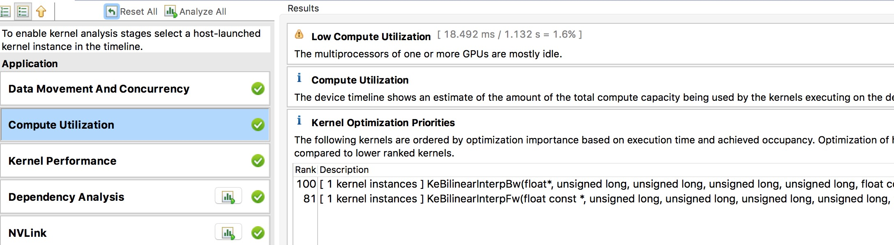

====================
Tune GPU Performance 
====================

..  contents::

This tutorial will guide you step-by-step through how to conduct profiling and performance tuning using built-in timer, **nvprof** and **nvvp**.

- What is profiling?
- Why we need profiling?
- How to do profiling?
- Profile tools
- Hands-on Tutorial
- Profiling tips

What's profiling?
=================
In software engineering, profiling is a form of dynamic program analysis that measures the space (memory) or time
complexity of a program, the usage of particular instructions, or the frequency and duration of function calls.
Most commonly, profiling information serves to aid program optimization.

Briefly, profiler is used to measure application performance. Program analysis tools are extremely important for
understanding program behavior. Simple profiling can tell you that how long does an operation take? For advanced
profiling, it can interpret why does an operation take a long time?

Why we need profiling?
======================
Since training deep neural network typically take a very long time to get over, performance is gradually becoming
the most important thing in deep learning field. The first step to improve performance is to understand what parts
are slow.  There is no point in improving performance of a region which doesn’t take much time!

How to do profiling?
====================
To achieve maximum performance, there are five steps you can take to reach your goals.

- Profile the code
- Find the slow parts
- Work out why they’re slow
- Make them fast
- Profile the code again

Usually, processor has two key performance limits include float point throughput and
memory throughput. For GPU,  it also need more parallelism to fulfill its potential.
This is why they can be so fast.

Profiler Tools
==============
For general GPU profiling, a bunch of tools are provided from both NVIDIA and third party.

**nvprof** is Nvidia profiler and **nvvp** is (GUI based) Nvidia visual profiler.
In this tutorial, we will focus on nvprof and nvvp.

:code:`test_GpuProfiler` from :code:`paddle/math/tests` directory will be used to evaluate
above profilers.

.. literalinclude:: ../../../../paddle/math/tests/test_GpuProfiler.cpp
   :language: c++
   :lines: 137-151
   :linenos:

The above code snippet includes two methods, you can use any of them to profile the regions of interest.

1. :code:`REGISTER_TIMER_INFO` is a built-in timer wrapper which can calculate the time overhead of both cpu functions and cuda kernels.

2. :code:`REGISTER_GPU_PROFILER` is a general purpose wrapper object of :code:`cudaProfilerStart` and :code:`cudaProfilerStop` to avoid
program crashes when CPU version of PaddlePaddle invokes them.

You can find more details about how to use both of them in the next session.

Hands-on Approach
=================

Built-in Timer
--------------

To enable built-in timer in PaddlePaddle, first you have to add :code:`REGISTER_TIMER_INFO` into the regions of you interest.
Then, all information could be stamped in the console via :code:`printStatus` or :code:`printAllStatus` function.
As a simple example, consider the following:

1. Add :code:`REGISTER_TIMER_INFO` and :code:`printAllStatus` functions (see the emphasize-lines).

    .. literalinclude:: ../../../../paddle/math/tests/test_GpuProfiler.cpp
        :language: c++
        :lines: 137-151
        :emphasize-lines: 8-12,14
        :linenos:

2. Configure cmake with **WITH_TIMER** and recompile PaddlePaddle.

    .. code-block:: bash

        cmake .. -DWITH_TIMER=ON
        make

3. Execute your code and observe the results (see the emphasize-lines).

    .. code-block:: bash
        :emphasize-lines: 1,12-15

        > ./paddle/math/tests/test_GpuProfiler
        I1117 11:13:42.313065 2522362816 Util.cpp:155] commandline: ./paddle/math/tests/test_GpuProfiler
        I1117 11:13:42.845065 2522362816 Util.cpp:130] Calling runInitFunctions
        I1117 11:13:42.845208 2522362816 Util.cpp:143] Call runInitFunctions done.
        [==========] Running 1 test from 1 test case.
        [----------] Global test environment set-up.
        [----------] 1 test from Profiler
        [ RUN      ] Profiler.BilinearFwdBwd
        I1117 11:13:42.845310 2522362816 test_GpuProfiler.cpp:114] Enable GPU Profiler Stat: [testBilinearFwdBwd] "numSamples = 10, channels = 16, im
        gSizeX = 64, imgSizeY = 64"
        I1117 11:13:42.850154 2522362816 ThreadLocal.cpp:37] thread use undeterministic rand seed:20659751
        I1117 11:13:42.981501 2522362816 Stat.cpp:130] ======= StatSet: [GlobalStatInfo] status ======
        I1117 11:13:42.981539 2522362816 Stat.cpp:133] Stat=testBilinearFwdBwd     total=136.141    avg=136.141    max=136.141    min=136.141   count=1
        I1117 11:13:42.981572 2522362816 Stat.cpp:141] ======= BarrierStatSet status ======
        I1117 11:13:42.981575 2522362816 Stat.cpp:154] --------------------------------------------------
        [       OK ] Profiler.BilinearFwdBwd (136 ms)
        [----------] 1 test from Profiler (136 ms total)

        [----------] Global test environment tear-down
        [==========] 1 test from 1 test case ran. (136 ms total)
        [  PASSED  ] 1 test.

nvprof profiler
---------------

To use this command line profiler **nvprof**, you can simply issue the following command:

1. Add :code:`REGISTER_GPU_PROFILER` function (see the emphasize-lines).

    .. literalinclude:: ../../../../paddle/math/tests/test_GpuProfiler.cpp
        :language: c++
        :lines: 137-151
        :emphasize-lines: 6-7
        :linenos:

2. Configure cmake with **WITH_PROFILER** and recompile PaddlePaddle.

    .. code-block:: bash

        cmake .. -DWITH_PROFILER=ON
        make

3. Use Nvidia profiler **nvprof** to profile the binary.

    .. code-block:: bash

        nvprof  ./paddle/math/tests/test_GpuProfiler

Then, you can get the following profiling result:

.. code-block:: bash

    ==78544== Profiling application: ./paddle/math/tests/test_GpuProfiler
    ==78544== Profiling result:
    Time(%)     Time     Calls       Avg       Min       Max  Name
    27.60%  9.6305ms         5  1.9261ms  3.4560us  6.4035ms  [CUDA memcpy HtoD]
    26.07%  9.0957ms         1  9.0957ms  9.0957ms  9.0957ms  KeBilinearInterpBw
    23.78%  8.2977ms         1  8.2977ms  8.2977ms  8.2977ms  KeBilinearInterpFw
    22.55%  7.8661ms         2  3.9330ms  1.5798ms  6.2863ms  [CUDA memcpy DtoH]

    ==78544== API calls:
    Time(%)     Time     Calls       Avg       Min       Max  Name
    46.85%  682.28ms         8  85.285ms  12.639us  682.03ms  cudaStreamCreateWithFlags
    39.83%  580.00ms         4  145.00ms     302ns  550.27ms  cudaFree
    9.82%   143.03ms         9  15.892ms  8.7090us  142.78ms  cudaStreamCreate
    1.23%   17.983ms         7  2.5690ms  23.210us  6.4563ms  cudaMemcpy
    1.23%   17.849ms         2  8.9247ms  8.4726ms  9.3768ms  cudaStreamSynchronize
    0.66%   9.5969ms         7  1.3710ms  288.43us  2.4279ms  cudaHostAlloc
    0.13%   1.9530ms        11  177.54us  7.6810us  591.06us  cudaMalloc
    0.07%   1.0424ms         8  130.30us  1.6970us  453.72us  cudaGetDevice
    0.04%   527.90us        40  13.197us     525ns  253.99us  cudaEventCreateWithFlags
    0.03%   435.73us       348  1.2520us     124ns  42.704us  cuDeviceGetAttribute
    0.03%   419.36us         1  419.36us  419.36us  419.36us  cudaGetDeviceCount
    0.02%   260.75us         2  130.38us  129.32us  131.43us  cudaGetDeviceProperties
    0.02%   222.32us         2  111.16us  106.94us  115.39us  cudaLaunch
    0.01%   214.06us         4  53.514us  28.586us  77.655us  cuDeviceGetName
    0.01%   115.45us         4  28.861us  9.8250us  44.526us  cuDeviceTotalMem
    0.01%   83.988us         4  20.997us     578ns  77.760us  cudaSetDevice
    0.00%   38.918us         1  38.918us  38.918us  38.918us  cudaEventCreate
    0.00%   34.573us        31  1.1150us     279ns  12.784us  cudaDeviceGetAttribute
    0.00%   17.767us         1  17.767us  17.767us  17.767us  cudaProfilerStart
    0.00%   15.228us         2  7.6140us  3.5460us  11.682us  cudaConfigureCall
    0.00%   14.536us         2  7.2680us  1.1490us  13.387us  cudaGetLastError
    0.00%   8.6080us        26     331ns     173ns     783ns  cudaSetupArgument
    0.00%   5.5470us         6     924ns     215ns  2.6780us  cuDeviceGet
    0.00%   5.4090us         6     901ns     328ns  3.3320us  cuDeviceGetCount
    0.00%   4.1770us         3  1.3920us  1.0630us  1.8300us  cuDriverGetVersion
    0.00%   3.4650us         3  1.1550us  1.0810us  1.2680us  cuInit
    0.00%      830ns         1     830ns     830ns     830ns  cudaRuntimeGetVersion

nvvp profiler
-------------

For visual profiler **nvvp**, you can either import the output of :code:`nvprof –o ...` or
run application through GUI.

**Note: nvvp also support CPU profiling** (Click the box in nvvp to enable profile execution on CPU).

..  image:: nvvp1.png
    :align: center
    :scale: 33%

From the perspective of kernel functions, **nvvp** can even illustrate why does an operation take a long time?
As shown in the following figure, kernel's block usage, register usage and shared memory usage from :code:`nvvp`
allow us to fully utilize all warps on the GPU.

..  image:: nvvp2.png
    :align: center
    :scale: 33%

From the perspective of application, **nvvp** can give you some suggestions to address performance bottleneck.
For instance, some advice in data movement and compute utilization from the below figure can guide you to tune performance.

..  image:: nvvp3.png
    :align: center
    :scale: 33%

Profiling tips
==============

- The **nvprof** and **nvvp** output is a very good place to start.
- The timeline is a good place to go next.
- Only dig deep into a kernel if it’s taking a significant amount of your time.
- Where possible, try to match profiler output with theory.
    1) For example, if I know I’m moving 1GB, and my kernel takes 10ms, I expect the profiler to report 100GB/s.
    2) Discrepancies are likely to mean your application isn’t doing what you thought it was.
- Know your hardware: If your GPU can do 6 TFLOPs, and you’re already doing 5.5 TFLOPs, you won’t go much faster!

Profiling is a key step in optimization. Sometimes quite simple changes can lead to big improvements in performance.
Your mileage may vary!

Reference
=========
Jeremy Appleyard, `GPU Profiling for Deep Learning <http://www.robots.ox.ac.uk/~seminars/seminars/Extra/2015_10_08_JeremyAppleyard.pdf>`_, 2015
