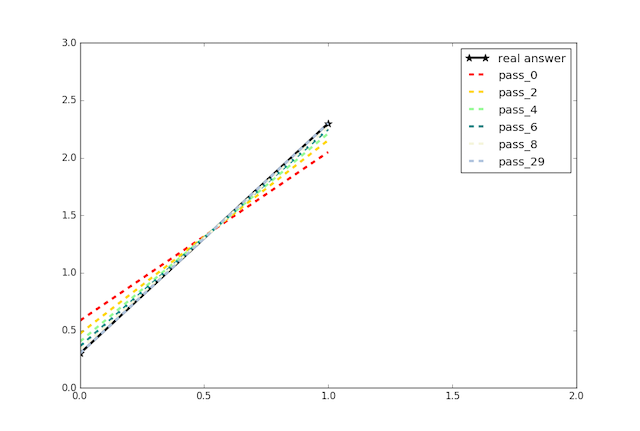

# 简介

PaddlePaddle 源于百度的开源深度学习平台，有如下几个特点。首先，简单易用的：用户可以通过简单的十几行配置脚本搭建经典的神经网络模型。其次，高效强大的：PaddlePaddle可以支撑复杂集群环境下超大模型的训练，令你受益于深度学习的前沿成果。最后，在百度内部，已经有大量产品线使用了基于PaddlePaddle的深度学习技术。

这份简短的介绍将像你展示如何利用PaddlePaddle来解决一个经典的机器学习问题。

## 1. 一个经典的任务

让我们从一个基础问题开始：<a href="https://www.baidu.com/s?wd=单变量线性回归">单变量的线性回归</a>。问题假定观测到了一批二维空间上的点`(x, y) `，并且已知 `x` 和 `y` 之间存在着某种线性关系，我们的目标是通过观测数据来学习这个线性关系。作为一个简单基础的模型，线性回归有着广泛的应用场景。以一个资产定价的问题为例，`x` 对应于房屋的大小，`y` 对应于房屋价格。我们可以通过观察市场上房屋销售的情况拟合 `x` 和 `y` 之间的关系，从而为新房屋的定价提供预测和参考。


## 2. 准备数据

假设变量 `X` 和 `Y` 的真实关系为： `Y = 2X + 0.3`，这里展示如何使用观测数据来拟合这一线性关系。首先，Python代码将随机产生2000个观测点，作为PaddlePaddle的输入。产生PaddlePaddle的输入数据和写一段普通的Python脚本几乎一样，你唯一需要增加的就是定义输入数据的类型。

```python
# -*- coding:utf-8 -*-
# dataprovider.py
from paddle.trainer.PyDataProvider2 import *
import random

# 定义输入数据的类型: 2个浮点数
@provider(input_types=[dense_vector(1), dense_vector(1)],use_seq=False)
def process(settings, input_file):
    for i in xrange(2000):
        x = random.random()
        yield [x], [2*x+0.3]
```

## 3. 训练模型

为了还原 `Y = 2X + 0.3`，我们先从一条随机的直线 `Y' = wX + b` 开始，然后利用观测数据调整 `w` 和 `b` 使得 `Y'` 和 `Y` 的差距不断减小，最终趋于接近。这个过程就是模型的训练过程，而 `w` 和 `b` 就是模型的参数，即我们的训练目标。

在PaddlePaddle里，该模型的网络配置如下。

```python
# -*- coding:utf-8 -*-
# trainer_config.py
from paddle.trainer_config_helpers import *

# 1. 定义数据来源，调用上面的process函数获得观测数据
data_file = 'empty.list'
with open(data_file, 'w') as f: f.writelines(' ')
define_py_data_sources2(train_list=data_file, test_list=None, 
        module='dataprovider', obj='process',args={})

# 2. 学习算法。控制如何改变模型参数 w 和 b
settings(batch_size=12, learning_rate=1e-3, learning_method=MomentumOptimizer())

# 3. 神经网络配置
x = data_layer(name='x', size=1)
y = data_layer(name='y', size=1)
# 线性计算网络层: y_predict = wx + b
y_predict = fc_layer(input=x, param_attr=ParamAttr(name='w'), size=1, act=LinearActivation(), bias_attr=ParamAttr(name='b'))
# 计算误差函数，即 y_predict 和真实 y 之间的距离
cost = regression_cost(input=y_predict, label=y)
outputs(cost)
```
这段简短的配置展示了PaddlePaddle的基本用法：

- 第一部分定义了数据输入。一般情况下，PaddlePaddle先从一个文件列表里获得数据文件地址，然后交给用户自定义的函数（例如上面的`process`函数）进行读入和预处理从而得到真实输入。本文中由于输入数据是随机生成的不需要读输入文件，所以放一个空列表（`empty.list`）即可。

- 第二部分主要是选择学习算法，它定义了模型参数改变的规则。PaddlePaddle提供了很多优秀的学习算法，这里使用一个基于momentum的随机梯度下降(SGD)算法，该算法每批量(batch)读取12个采样数据进行随机梯度计算来更新更新。

- 最后一部分是神经网络的配置。由于PaddlePaddle已经实现了丰富的网络层，所以很多时候你需要做的只是定义正确的网络层并把它们连接起来。这里使用了三种网络单元：
	- **数据层**：数据层 `data_layer` 是神经网络的入口，它读入数据并将它们传输到接下来的网络层。这里数据层有两个，分别对应于变量 `X` 和 `Y`。
	- **全连接层**：全连接层 `fc_layer` 是基础的计算单元，这里利用它建模变量之间的线性关系。计算单元是神经网络的核心，PaddlePaddle支持大量的计算单元和任意深度的网络连接，从而可以拟合任意的函数来学习复杂的数据关系。
	- **回归误差代价层**：回归误差代价层 `regression_cost`是众多误差代价函数层的一种，它们在训练过程作为网络的出口，用来计算模型的误差，是模型参数优化的目标函数。

定义了网络结构并保存为`trainer_config.py`之后，运行以下训练命令：
 ```
 paddle train --config=trainer_config.py --save_dir=./output --num_passes=30
 ```

PaddlePaddle将在观测数据集上迭代训练30轮，并将每轮的模型结果存放在 `./output` 路径下。从输出日志可以看到，随着轮数增加误差代价函数的输出在不断的减小，这意味着模型在训练数据上不断的改进，直到逼近真实解：` Y = 2X + 0.3 `

## 4. 模型检验

训练完成后，我们希望能够检验模型的好坏。一种常用的做法是用学习的模型对另外一组测试数据进行预测，评价预测的效果。在这个例子中，由于已经知道了真实答案，我们可以直接观察模型的参数是否符合预期来进行检验。

PaddlePaddle将每个模型参数作为一个numpy数组单独存为一个文件，所以可以利用如下方法读取模型的参数。

```python
import numpy as np
import os

def load(file_name):
    with open(file_name, 'rb') as f:
        f.read(16) # skip header for float type.
        return np.fromfile(f, dtype=np.float32)
        
print 'w=%.6f, b=%.6f' % (load('output/pass-00029/w'), load('output/pass-00029/b'))
# w=1.999743, b=0.300137
```
<center>  </center>

从图中可以看到，虽然 `w` 和 `b` 都使用随机值初始化，但在起初的几轮训练中它们都在快速逼近真实值，并且后续仍在不断改进，使得最终得到的模型几乎与真实模型一致。

这样，我们用PaddlePaddle解决了单变量线性回归问题， 包括数据输入，模型训练和最后的结果验证。

## 5. 推荐后续阅读

- <a href="../build_and_install/index.html">安装/编译</a>：PaddlePaddle的安装与编译文档。
- <a href="../demo/quick_start/index.html">快速入门 </a>：使用商品评论分类任务，系统性的介绍如何一步步改进，最终得到产品级的深度模型。
- <a href="../demo/index.html">示例</a>：各种实用案例，涵盖图像、文本、推荐等多个领域。
