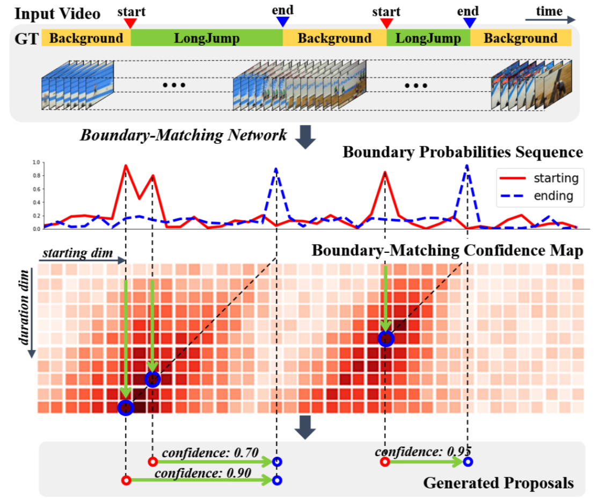

# BMN 视频动作定位模型高层API实现

---
## 内容

- [模型简介](#模型简介)
- [代码结构](#代码结构)
- [数据准备](#数据准备)
- [模型训练](#模型训练)
- [模型评估](#模型评估)
- [模型推断](#模型推断)
- [参考论文](#参考论文)


## 模型简介

BMN模型是百度自研，2019年ActivityNet夺冠方案，为视频动作定位问题中proposal的生成提供高效的解决方案，在PaddlePaddle上首次开源。此模型引入边界匹配(Boundary-Matching, BM)机制来评估proposal的置信度，按照proposal开始边界的位置及其长度将所有可能存在的proposal组合成一个二维的BM置信度图，图中每个点的数值代表其所对应的proposal的置信度分数。网络由三个模块组成，基础模块作为主干网络处理输入的特征序列，TEM模块预测每一个时序位置属于动作开始、动作结束的概率，PEM模块生成BM置信度图。

<p align="center">
 <br />
BMN Overview
</p>


## 代码结构
```
├── bmn.yaml           # 网络配置文件，快速配置参数
├── run.sh             # 快速运行脚本，可直接开始多卡训练
├── train.py           # 训练代码，训练网络
├── eval.py            # 评估代码，评估网络性能
├── predict.py         # 预测代码，针对任意输入预测结果
├── bmn_metric.py      # 精度评估方法定义
├── reader.py          # 数据reader，构造Dataset和Dataloader
├── bmn_utils.py       # 模型细节相关代码
├── config_utils.py    # 配置细节相关代码
├── eval_anet_prop.py  # 计算精度评估指标
└── infer.list         # 推断文件列表
```


## 数据准备

BMN的训练数据采用ActivityNet1.3提供的数据集，我们提供了处理好的视频特征和对应的标签文件，请下载特征数据[bmn\_feat](https://paddlemodels.bj.bcebos.com/video_detection/bmn_feat.tar.gz)和标签数据[label](https://paddlemodels.bj.bcebos.com/video_detection/activitynet_1.3_annotations.json)，并相应地修改配置文件bmn.yaml中的特征文件路径feat\_path和标签文件路径anno\_file。


## 模型训练

数据准备完成后，可通过如下两种方式启动训练：

默认使用4卡训练，启动方式如下:

    bash run.sh

若使用单卡训练，请将配置文件bmn.yaml中的batch\_size调整为16，启动方式如下:

    python train.py

默认使用静态图训练，若使用动态图训练只需要在运行脚本添加`-d`参数即可，如：

    python train.py -d

- 代码运行需要先安装pandas

- 从头开始训练，使用上述启动命令行或者脚本程序即可启动训练，不需要用到预训练模型


## 模型评估

训练完成后，可通过如下方式进行模型评估:

    python eval.py --weights=$PATH_TO_WEIGHTS

- 进行评估时，可修改命令行中的`weights`参数指定需要评估的权重，若未指定，脚本会下载已发布的模型[model](https://paddlemodels.bj.bcebos.com/hapi/bmn.pdparams)进行评估。

- 上述程序会将运行结果保存在`--output_path`参数指定的文件夹下，默认为output/EVAL/BMN\_results；测试结果保存在`--result_path`参数指定的文件夹下，默认为evaluate\_results。

- 注：评估时可能会出现loss为nan的情况。这是由于评估时用的是单个样本，可能存在没有iou>0.6的样本，所以为nan，对最终的评估结果没有影响。


使用ActivityNet官方提供的测试脚本，即可计算AR@AN和AUC。具体计算过程如下：

- ActivityNet数据集的具体使用说明可以参考其[官方网站](http://activity-net.org)

- 下载指标评估代码，请从[ActivityNet Gitub repository](https://github.com/activitynet/ActivityNet.git)下载，将Evaluation文件夹拷贝至hapi/examples/bmn目录下。(注：由于第三方评估代码不支持python3，此处建议使用python2进行评估；若使用python3，print函数需要添加括号，请对Evaluation目录下的.py文件做相应修改。)

- 请下载[activity\_net\_1\_3\_new.json](https://paddlemodels.bj.bcebos.com/video_detection/activity_net_1_3_new.json)文件，并将其放置在hapi/examples/bmn/Evaluation/data目录下，相较于原始的activity\_net.v1-3.min.json文件，我们过滤了其中一些失效的视频条目。

- 计算精度指标

    ```python eval_anet_prop.py```


在ActivityNet1.3数据集下评估精度如下:

| AR@1 | AR@5 | AR@10 | AR@100 | AUC |
| :---: | :---: | :---: | :---: | :---: |
| 33.10 | 49.18 | 56.54 | 75.12 | 67.16% |


## 模型推断

可通过如下方式启动模型推断：

    python predict.py --weights=$PATH_TO_WEIGHTS \
                      --filelist=$FILELIST

- 使用python命令行启动程序时，`--filelist`参数指定待推断的文件列表，如果不设置，默认为./infer.list。`--weights`参数为训练好的权重参数，若未指定，脚本会下载已发布的模型[model](https://paddlemodels.bj.bcebos.com/hapi/bmn.pdparams)进行预测。

- 上述程序会将运行结果保存在`--output_path`参数指定的文件夹下，默认为output/INFER/BMN\_results；测试结果保存在`--result_path`参数指定的文件夹下，默认为predict\_results。


## 参考论文

- [BMN: Boundary-Matching Network for Temporal Action Proposal Generation](https://arxiv.org/abs/1907.09702), Tianwei Lin, Xiao Liu, Xin Li, Errui Ding, Shilei Wen.
