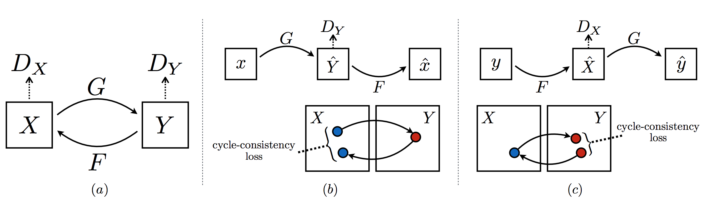
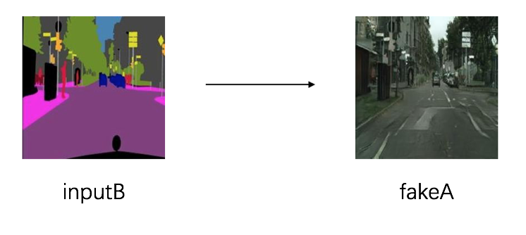

# Cycle GAN
---
## 内容

- [安装](#安装)
- [简介](#简介)
- [代码结构](#代码结构)
- [数据准备](#数据准备)
- [模型训练与预测](#模型训练与预测)

## 安装

运行本目录下的程序示例需要使用PaddlePaddle develop最新版本。如果您的PaddlePaddle安装版本低于此要求，请按照[安装文档](http://www.paddlepaddle.org/docs/develop/documentation/zh/build_and_install/pip_install_cn.html)中的说明更新PaddlePaddle安装版本。

## 简介
Cycle GAN 是一种image to image 的图像生成网络，实现了非对称图像数据集的生成和风格迁移。模型结构如下图所示，我们的模型包含两个生成网络 G: X → Y 和 F: Y → X，以及相关的判别器 DY 和 DX 。通过训练DY,使G将X图尽量转换为Y图，反之亦然。同时引入两个“周期一致性损失”，它们保证:如果我们从一个领域转换到另一个领域，它还可以被转换回去:(b)正向循环一致性损失:x→G(x)→F(G(x))≈x， (c)反向循环一致性损失:y→F(y)→G(F(y))≈y

<p align="center">
 <br />
图1.网络结构
</p>


## 代码结构
```
├── data.py      # 读取、处理数据。
├── layers.py    # 封装定义基础的layers。
├── cyclegan.py  # 定义基础生成网络和判别网络。
├── train.py     # 训练脚本。
└── infer.py     # 预测脚本。
```


## 数据准备

CycleGAN 支持的数据集可以参考download.py中的`cycle_pix_dataset`，可以通过指定`python download.py --dataset xxx` 下载得到。

由于版权问题，cityscapes 数据集无法通过脚本直接获得，需要从[官方](https://www.cityscapes-dataset.com/)下载数据，
下载完之后执行`python prepare_cityscapes_dataset.py --gtFine_dir ./gtFine/ --leftImg8bit_dir ./leftImg8bit --output_dir ./data/cityscapes/`处理，
将数据存放在`data/cityscapes`。

数据下载处理完毕后，需要您将数据组织为以下路径结构：
```
data
|-- cityscapes
|   |-- testA
|   |-- testB
|   |-- trainA
|   |-- trainB

```

然后运行txt生成脚本：`python generate_txt.py`，最终数据组织如下所示:
```
data
|-- cityscapes
|   |-- testA
|   |-- testA.txt
|   |-- testB
|   |-- testB.txt
|   |-- trainA
|   |-- trainA.txt
|   |-- trainB
|   `-- trainB.txt

```

以上数据文件中，`data`文件夹需要放在训练脚本`train.py`同级目录下。`testA`为存放真实街景图片的文件夹，`testB`为存放语义分割图片的文件夹，`testA.txt`和`testB.txt`分别为测试图片路径列表文件，格式如下：

```
data/cityscapes/testA/234_A.jpg
data/cityscapes/testA/292_A.jpg
data/cityscapes/testA/412_A.jpg
```

训练数据组织方式与测试数据相同。


## 模型训练与预测

### 训练

在GPU单卡上训练:

```
env CUDA_VISIBLE_DEVICES=0 python train.py
```

执行`python train.py --help`可查看更多使用方式和参数详细说明。

图1为训练152轮的训练损失示意图，其中横坐标轴为训练轮数，纵轴为在训练集上的损失。其中，'g_loss','da_loss'和'db_loss'分别为生成器、判别器A和判别器B的训练损失。


### 测试

执行以下命令可以选择已保存的训练权重，对测试集进行测试，通过 `--epoch` 制定权重轮次：

```
env CUDA_VISIBLE_DEVICES=0 python test.py --init_model=checkpoint/199
```
生成结果在 `output/eval`中


### 预测

执行以下命令读取单张或多张图片进行预测：

真实街景生成分割图像：

```
env CUDA_VISIBLE_DEVICES=0 python infer.py \
    --init_model="./checkpoints/199" --input="./image/testA/123_A.jpg" \
    --input_style=A
```

分割图像生成真实街景：

```
env CUDA_VISIBLE_DEVICES=0 python infer.py \
    --init_model="checkpoints/199" --input="./image/testB/78_B.jpg" \
    --input_style=B
```
生成结果在 `output/single`中

训练180轮的模型预测效果如fakeA和fakeB所示：


<p align="center">
 <br/>
<strong>A2B</strong>
</p>


<p align="center">
 <br/>
<strong>B2A</strong>
</p>

>在本文示例中，均可通过修改`CUDA_VISIBLE_DEVICES`改变使用的显卡号。
