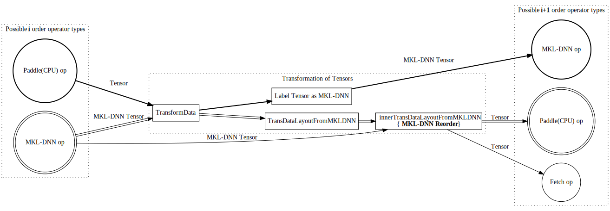

# Design Doc: MKL-DNN Data Transformation

When fluid is using MKL-DNN engine to execute program, not all operators are having mkl-dnn kernels and some of operators are executed by CPU. MKL-DNN kernels of operators expect input Tensors to be provided in MKL-DNN layout , while Paddle(CPU) kernels are expecting input Tensors to be of Paddle layout.

We can distinguish following scenarios(presented below on the picture):
* Paddle(CPU) kernel is followed by MKL-DNN kernel
* MKL-DNN kernel is followed by Paddle(CPU) kernel
* MKL-DNN kernel is followed by fetch operator

### Paddle(CPU) kernel is followed by MKL-DNN kernel
In a situation when Paddle(CPU) kernel finished execution, its outcome is one or many Tensors of Paddle layout. Each of those
Tensors to be feed into MKL-DNN kernel, needs to be transformed to be of MKL-DNN layout. For this scenario conversion of Paddle Tensor to MKL-DNN Tensor is done by just
changing layout flag to MKL-DNN and picking MKL-DNN format that match Paddle Tensor rank. This is computationally cheap operation as there is no real data rearrangement.

This scenario is drawn on the picture with bold lines. Starting from Paddle(CPU) op on the left side , following arrows drawn in bold and finishing with MKL-DNN op on the right side of picture.

### MKL-DNN kernel is followed by Paddle(CPU) kernel
In this situation MKL-DNN kernel finished its execution and as a result it produced one or more output Tensors. Each of those Tensors are of MKL-DNN layout and to be fed into Paddle(CPU) kernel,
they need to be converted into Paddle layout. In a detail MKL-DNN Tensor arrangement (mkl-dnn memory format) is checked if it is compatible with Paddle(CPU) layout and if positive then
just layout of Tensor is set as Paddle and mkl-dnn format is set to ``undef``. In case when MKL-DNN Tensor data arrangement is not compatible with Paddle layout then actual data arrangement
is performed. For example MKL-DNN Tensor is 4D and having format ``NCHW16C`` and to convert it into Paddle layout we need to rearrange data to be ``NCHW`` format. To do so
MKL-DNN Reorder primitive is created that can do data rearrangement. 

This scenario is marked on the picture with outlined, empty inside arrows. Starting from MKL-DNN op on the left side , following empty arrows finishing with Paddle(CPU) op on the right side of picture.
### MKL-DNN kernel is followed by fetch operator
This situation is similar conceptually to previous section, but because fetch operator is an operator without kernel then it does not share data transformation code with operators that are having kernel registered.
Hence execution flow looks a bit different, although conceptually conversion of MKL-DNN Tensor into Paddle(CPU) Tensor is the same as in a described above

This scenario is marked on the picture with regular arrows. Starting from MKL-DNN op on the left side , following regular arrows finishing with fetch op on the right side of picture.
### GPU and MKL-DNN kernels interoperability.
Currently Fluid is not supporting execution of programs by using combination of MKL-DNN and GPU kernels
