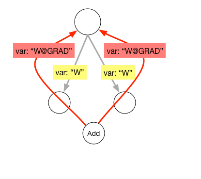

# Operator/expression 's Backward

## Motivation

In Neural Network, many model is solved by the the backpropagation algorithm(known as BP) at present. Technically it caculates the gradient of the loss function, then distributed back through the networks. Follows the chain rule, so we need a module chains the gradient operators/expressions together with to construct the backward pass. Every forward network needs a backward network to construct the full computation graph, the operator/expression's backward pass will be generated respect to forward pass. 

## Implementation

In this design doc, we exported only one API for generating the backward pass.

```c++
std::unique_ptr<OperatorBase> Backward(const OperatorBase& forwardOp,
    const std::unordered_set<std::string>& no_grad_vars);
```

The implementation behind it can be divided into two parts, **Backward Operator Creating** and **Backward Operator Building**.

### Backward Operator Registry

A backward network is built up with several backward operators. Backward operators take forward operators' inputs, outputs, and output gradients and then calculate its input gradients.

|                        | forward operator | backward operator 
| ---------------------- | ---------------- |------------------------- |		
| **Operator::inputs_**  | Inputs       | Inputs, Outputs, OutputGradients |	
| **Operator::outputs_** | Outputs          | InputGradients            |

 In most cases, there is a one-to-one correspondence between the forward and backward operators. These correspondences are recorded by a global hash map(`OpInfoMap`). To follow the philosophy of minimum core and make operators pluggable, the registry mechanism is introduced.

For example, we have got a `mul_op`, and we can register its information and corresponding backward operator by the following macro:

```cpp
REGISTER_OP(mul, MulOp, MulOpMaker, mul_grad, MulOpGrad);
```

`mul` is the operator's type. `MulOp` and `MulOpMaker` are the operator class and the operator maker class respectively.

`mul_grad` is the type of backward operator, and `MulOpGrad` is its class name.

### Backward Opeartor Creating

Given a certain forward operator, we can get its corresponding backward operator by calling:

```cpp
OperatorBase* bwd_op = BuildGradOp(const OperatorBase* fwd_op);
```

The function `BuildGradOp` will sequentially execute following processes:

1. Get the `type_` of given forward operator, and then get the corresponding backward operator's type by looking up the `OpInfoMap`.

2. Build two maps named `inputs` and `outputs` to temporary storage backward operator's inputs and outputs. Copy forward operator's `inputs_` and `outputs_` to map `inputs`, except these, are not necessary for gradient computing.

3. Add forward inputs' gradient variables into map `output`, adding forward outputs' gradient variables into map `input`.

4. Building backward operator with `inputs`, `outputs` and forward operator's attributes.

### Backward Network Building

A backward network is a series of backward operators. The main idea of building a backward network is creating backward operators in the inverted sequence and append them together one by one. There is some corner case need to process specially.

1. Op 

   When the input forward network is an Op, return its gradient Operator Immediately. If all of its outputs are in no gradient set, then return a special `NOP`.

2. NetOp 

   In our design, the network itself is also a kind of operator(**NetOp**). So the operators contained by a big network may be some small network. When the input forward network is a NetOp, it needs to call the sub NetOp/Operators backward function recursively. During the process, we need to collect the `OutputGradients` name according to the forward NetOp.

3. RnnOp

   RnnOp is a nested stepnet operator.  Backward module need to recusively call `Backward` for every stepnet.

4. Sharing Variables

   **sharing variables**. As illustrated in the pictures, two operator's share the same variable name of W@GRAD, which will overwrite their sharing input variable. 

<p align="center">
<br/>

​	pic 1. Sharing variables in operators. 

</p>

​	Sharing variable between operators or same input variable used in multiple operators leads to a duplicate gradient variable. As demo show above, we need to rename gradient name recursively and add a generic add operator to replace the overwrite links. 

<p align="center">
<br/>

​	pic 2. Replace sharing variable's gradient with `Add` operator.

</p>

​	Because our framework finds variables accord to their names, we need to rename the output links. We add a suffix of number to represent its position in clockwise. 

5. Part of Gradient is Zero.

   In the whole graph, there is some case of that one operator's gradient is not needed, but its input's gradient is a dependency link of other operator,  we need to fill a same shape gradient matrix in the position. In our implement, we insert a special `fillZeroLike` operator.


Follow these rules above, then collect the sub graph `OutputGradients`/`InputGradients` as the NetOp's and return it.
