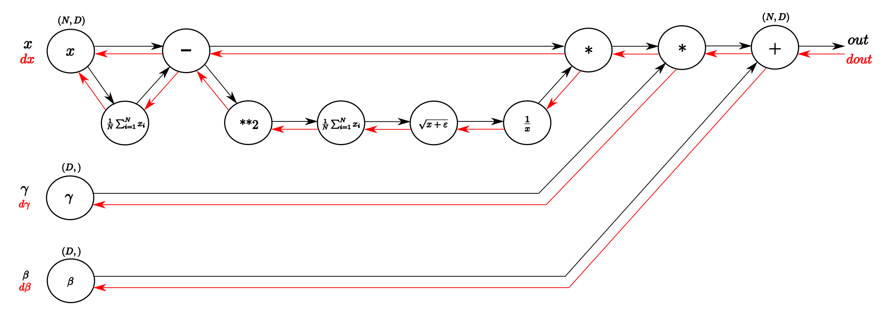

# Batch Normalization

## What is batch normalization

Batch normalization is a frequently-used method in deep network training. It adjusts the mean and variance of a layer's output, and make the data distribution easier for next layer's training. 

The principle of batch normalization can be summarized into a simple function:

```
y = (x - E[x]) / STD[x]) * scale + bias
```

`x` is a batch of output data of a certain layer. `E[x]` and `STD[x]` is the mean and standard deviation of `x`, respectively。 `scale` and `bias` are two trainable parameters. The training of batch normalization layer equals to the learning of best values of `scale` and `bias`.

In our design, we use a single operator(`batch_norm_op`) to implement the whole batch normalization in C++, and wrap it as a layer in Python.

## Differences with normal operators

`batch_norm_op` is a single operator. However, there are a few differences between `BatchNormOp` and normal operators, which we shall take into consideration in our design.

1. `batch_norm_op` shall behave differently in training and inferencing. For example, during inferencing, there is no batch data and it's impossible to compute `E[x]` and `STD[x]`, so we have to use an `estimated_mean` and an `estimated_variance` instead of them. These require our framework to be able to inform operators current running type (training/inferencing), then operators can switch their behaviors.

2. `batch_norm_op` shall have the ability to maintain `estimated_mean` and `estimated_variance` across mini-batch. In each mini-batch, `estimated_mean` is iterated by the following equations:

```
if batch_id == 0
  estimated_mean = E[x]
else
  estimated_mean = estimated_mean * momentum + (1.0 - momentum_) * E[x]
```

The iterating of `estimated_variance` is similar. `momentum` is an attribute, which controls estimated_mean updating speed.

## Implementation

Batch normalization is designed as a single operator is C++, and then wrapped as a layer in Python.

### C++

As most C++ operators do, `batch_norm_op` is defined by inputs, outputs, attributes and compute kernels.

#### Inputs

- `x`: The inputs data, which is generated by the previous layer.
- `estimated_mean`: The estimated mean of all previous data batches. It is updated in each forward propagation and will be used in inferencing to take the role of `E[x]`.
- `estimated_var`: The estimated standard deviation of all previous data batches. It is updated in each forward propagation and will be used in inferencing to take the role of `STD[x]`.
- `scale`: trainable parameter 'scale'
- `bias`: trainable parameter 'bias'

#### Outputs

- `y`: The output data.
- `batch_mean`: The mean value of batch data.
- `batch_var`: The standard deviation value of batch data.
- `saved_mean`: Updated `estimated_mean` with current batch data. It's supposed to share the memory with input `estimated_mean`.
- `saved_var`: Updated `estimated_var` with current batch data. It's supposed to share the memory with input `estimated_var`.

#### Attributes

- `is_infer`: *bool*. If true, run `batch_norm_op` in inferencing model.
- `use_global_est`: *bool*. If true, use `saved_mean` and `saved_var` instead of `E[x]` and `STD[x]` in trainning.
- `epsilon`: *float*. The epsilon value to avoid division by zero.
- `momentum`: *float*. Factor used in `estimated_mean` and `estimated_var` updating. The usage is shown above.

#### Kernels

The following graph showes the training computational process of `batch_norm_op`:



cudnn provides APIs to finish the whole series of computation, we can use them in our GPU kernel.

### Python

`batch_norm_op` is warpped as a layer in Python:

```python 
def batch_norm_layer(net, 
                     input,
                     output, 
                     scale, 
                     bias, 
                     use_global_est = False, 
                     epsilon = 1e-6,
                     momentum = 0.99):
	mean_cache = scope.new_var(name = 'estimated_mean', trainable = False)
	var_cache = scop.new_var(name = 'estimated_var', trainable = False)
	batch_mean = scope.new_var(name = 'batch_mean')
	batch_var = scope.new_var(name = 'batch_var')
	batch_norm_op = Operator('batch_norm_op',
	                         x = input,
	                         estimated_mean = mean_cache,
	                         estimated_mean = var_cache,
	                         scale = scale,
	                         bias = bias,
	                         y = output,
	                         batch_mean = batch_mean,
	                         batch_var = batch_var,
	                         saved_mean = mean_cache,
	                         saved_var = var_cache,
	                         is_infer = False,
	                         use_global_est = use_global_est,
	                         epsilon = epsilon,
	                         momentum = momentum)
	net.append_op(batch_norm_op)
	return output
```

Because Python API has not been finally decided, the code above can be regarded as pseudo code. There are a few key points we shall note:

1. `estimated_mean` and `estimated_var` are assigned the same variables with `saved_mean` and `saved_var` respectively. So they share same the memories. The output mean and variance values(`saved_mean` and `saved_var`) of a certain batch will be the inputs(`estimated_mean` and `estimated_var`) of the next batch.

2. `is_infer` decided whether `batch_norm_op` will run in training model or inferencing model. However, a model may contains both training and inferencing parts. And user may switch `batch_norm_op`'s running model in Python `for` loop like this:

```python
for pass_id in range(PASS_NUM):
    # ...
    net.train()  # run training model
    if pass_id % 100 == 0:
        net.infer(test_image)    # run inferencing model
    # ...
``` 

`is_infer` is an attribute. Once an operator is created, its attributes can not be changed. It suggests us that we shall maintain two `batch_norm_op` in the model, one's `is_infer` is `True`(we call it `infer_batch_norm_op`) and the other one's is `False`(we call it `train_batch_norm_op`). They share all parameters and variables. How to organize them is related with Python API design, so I leave it here for further discussion.
