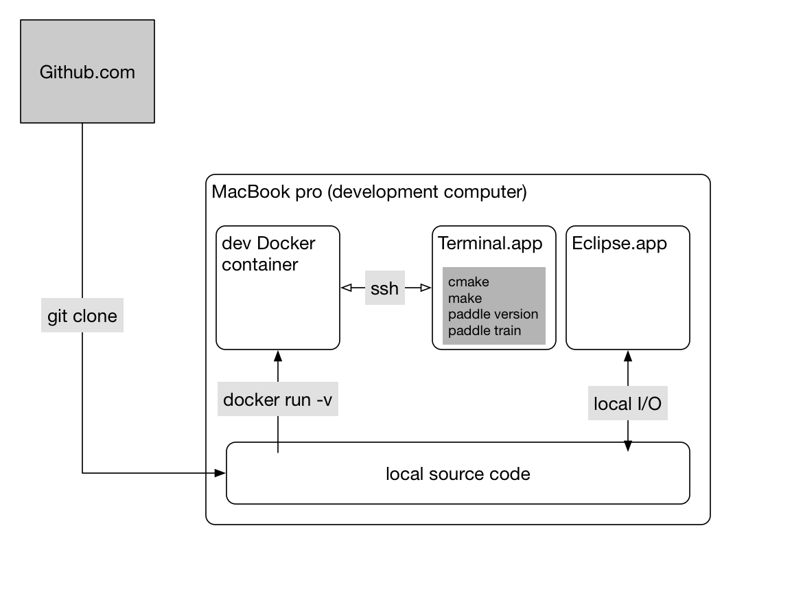
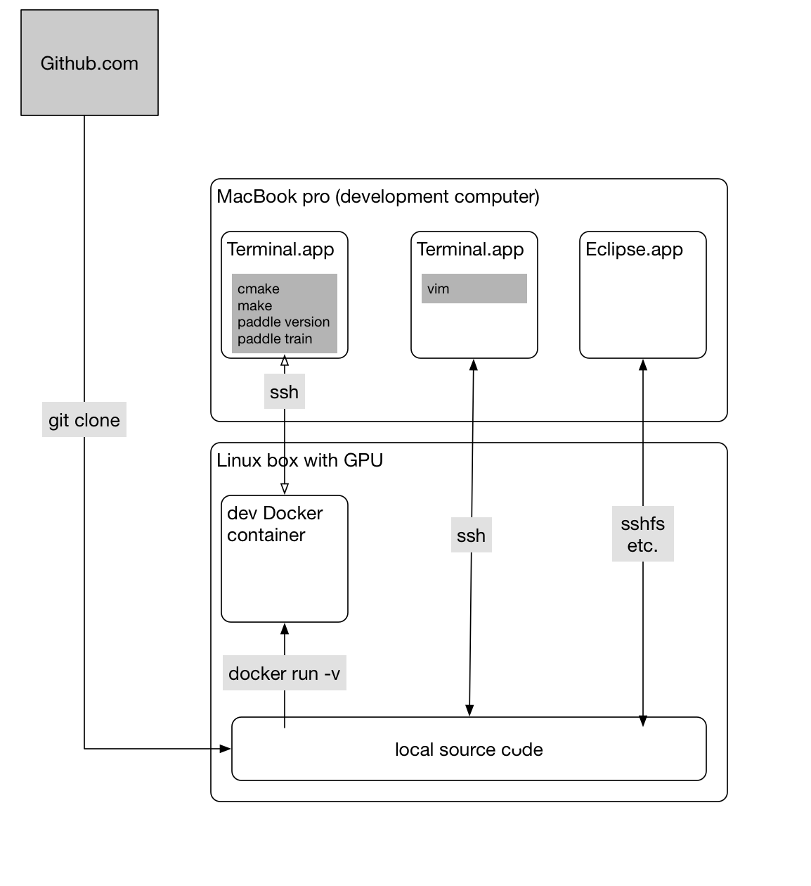

# Building PaddlePaddle

## Goals

We want to make the building procedures:

1. Static, can reproduce easily.
1. Generate python `whl` packages that can be widely use cross many distributions.
1. Build different binaries per release to satisfy different environments:
    - Binaries for different CUDA and CUDNN versions, like CUDA 7.5, 8.0, 9.0
    - Binaries containing only capi
    - Binaries for python with wide unicode support or not.
1. Build docker images with PaddlePaddle pre-installed, so that we can run
PaddlePaddle applications directly in docker or on Kubernetes clusters.

To achieve this, we maintain a dockerhub repo:https://hub.docker.com/r/paddlepaddle/paddle
which provides pre-built environment images to build PaddlePaddle and generate corresponding `whl`
binaries.(**We strongly recommend building paddlepaddle in our pre-specified Docker environment.**)

## Development Workflow

Here we describe how the workflow goes on.  We start from considering our daily development environment.

Developers work on a computer, which is usually a laptop or desktop:



or, they might rely on a more sophisticated box (like with GPUs):



A principle here is that source code lies on the development computer (host) so that editors like Eclipse can parse the source code to support auto-completion.

## Build With Docker

### Build Environments

The lastest pre-built build environment images are:

| Image | Tag |
| ----- | --- |
| paddlepaddle/paddle | latest-dev |

### Start Build

```bash
git clone https://github.com/PaddlePaddle/Paddle.git
cd Paddle
./paddle/scripts/paddle_docker_build.sh build
```

After the build finishes, you can get output `whl` package under
`build/python/dist`.

This command will download the most recent dev image from docker hub, start a container in the backend and then run the build script `/paddle/paddle/scripts/paddle_build.sh build` in the container.
The container mounts the source directory on the host into `/paddle`.
When it writes to `/paddle/build` in the container, it writes to `$PWD/build` on the host indeed.

### Build Options

Users can specify the following Docker build arguments with either "ON" or "OFF" value:

| Option | Default | Description |
| ------ | -------- | ----------- |
| `WITH_GPU` | OFF | Generates NVIDIA CUDA GPU code and relies on CUDA libraries. |
| `WITH_AVX` | OFF | Set to "ON" to enable AVX support. |
| `WITH_TESTING` | OFF | Build unit tests binaries. |
| `WITH_MKL` | ON | Build with [Intel® MKL](https://software.intel.com/en-us/mkl) and [Intel® MKL-DNN](https://github.com/01org/mkl-dnn) support. |
| `WITH_PYTHON` | ON | Build with python support. Turn this off if build is only for capi. |
| `WITH_STYLE_CHECK` | ON | Check the code style when building. |
| `PYTHON_ABI` | "" | Build for different python ABI support, can be cp27-cp27m or cp27-cp27mu |
| `RUN_TEST` | OFF | Run unit test immediently after the build. |

## Docker Images

You can get the latest PaddlePaddle docker images by
`docker pull paddlepaddle/paddle:<version>` or build one by yourself.

### Official Docker Releases

Official docker images at
[here](https://hub.docker.com/r/paddlepaddle/paddle/tags/),
you can choose either latest or images with a release tag like `0.10.0`,
Currently available tags are:

|   Tag  | Description |
| ------ | --------------------- |
| latest | latest CPU only image |
| latest-gpu | latest binary with GPU support |
| 0.10.0 | release 0.10.0 CPU only binary image |
| 0.10.0-gpu | release 0.10.0 with GPU support |

### Build Your Own Image

Build PaddlePaddle docker images are quite simple since PaddlePaddle can
be installed by just running `pip install`. A sample `Dockerfile` is:

```dockerfile
FROM nvidia/cuda:7.5-cudnn5-runtime-centos6
RUN yum install -y centos-release-SCL
RUN yum install -y python27
# This whl package is generated by previous build steps.
ADD python/dist/paddlepaddle-0.10.0-cp27-cp27mu-linux_x86_64.whl /
RUN pip install /paddlepaddle-0.10.0-cp27-cp27mu-linux_x86_64.whl && rm -f /*.whl
```

Then build the image by running `docker build -t [REPO]/paddle:[TAG] .` under
the directory containing your own `Dockerfile`.

We also release a script and Dockerfile for building PaddlePaddle docker images
across different cuda versions. To build these docker images, run:

```bash
bash ./build_docker_images.sh
docker build -t [REPO]/paddle:tag -f [generated_docker_file] .
```

- NOTE: note that you can choose different base images for your environment, you can find all the versions [here](https://hub.docker.com/r/nvidia/cuda/).

### Use Docker Images

Suppose that you have written an application program `train.py` using
PaddlePaddle, we can test and run it using docker:

```bash
docker run --rm -it -v $PWD:/work paddlepaddle/paddle /work/a.py
```

But this works only if all dependencies of `train.py` are in the production image. If this is not the case, we need to build a new Docker image from the production image and with more dependencies installs.

### Run PaddlePaddle Book In Docker

Our [book repo](https://github.com/paddlepaddle/book) also provide a docker
image to start a jupiter notebook inside docker so that you can run this book
using docker:

```bash
docker run -d -p 8888:8888 paddlepaddle/book
```

Please refer to https://github.com/paddlepaddle/book if you want to build this
docker image by your self.

### Run Distributed Applications

In our [API design doc](https://github.com/PaddlePaddle/Paddle/blob/develop/doc/design/api.md#distributed-training), we proposed an API that starts a distributed training job on a cluster.  This API need to build a PaddlePaddle application into a Docker image as above and calls kubectl to run it on the cluster.  This API might need to generate a Dockerfile look like above and call `docker build`.

Of course, we can manually build an application image and launch the job using the kubectl tool:

```bash
docker build -f some/Dockerfile -t myapp .
docker tag myapp me/myapp
docker push
kubectl ...
```


## More Options

### Build Without Docker

Follow the *Dockerfile* in the paddlepaddle repo to set up your local dev environment and run:

```bash
./paddle/scripts/paddle_build.sh build
```

### Additional Tasks

You can get the help menu for the build scripts by running with no options:

```bash
./paddle/scripts/paddle_build.sh
or ./paddle/scripts/paddle_docker_build.sh
```
