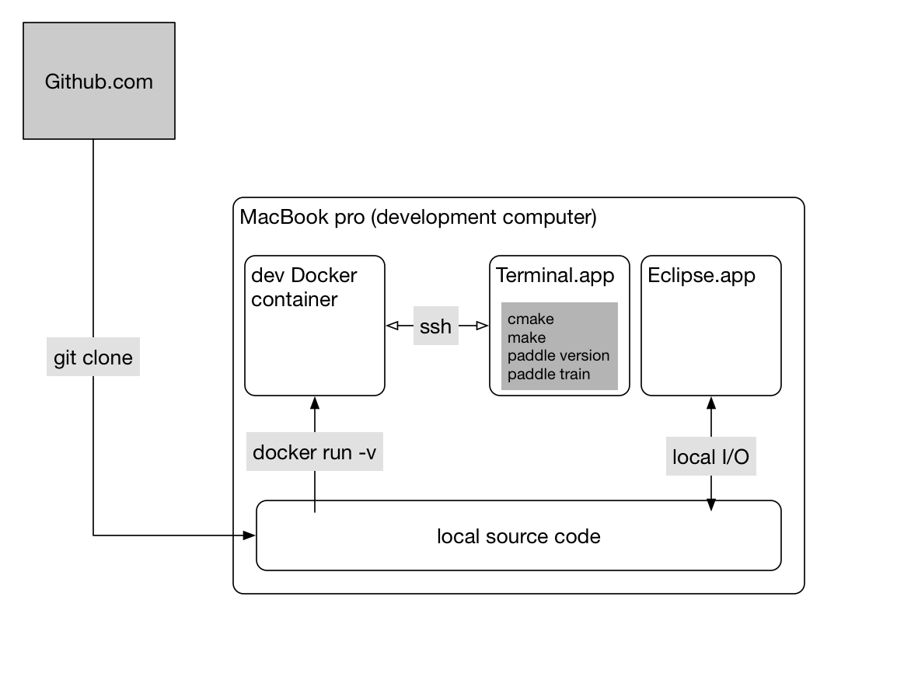
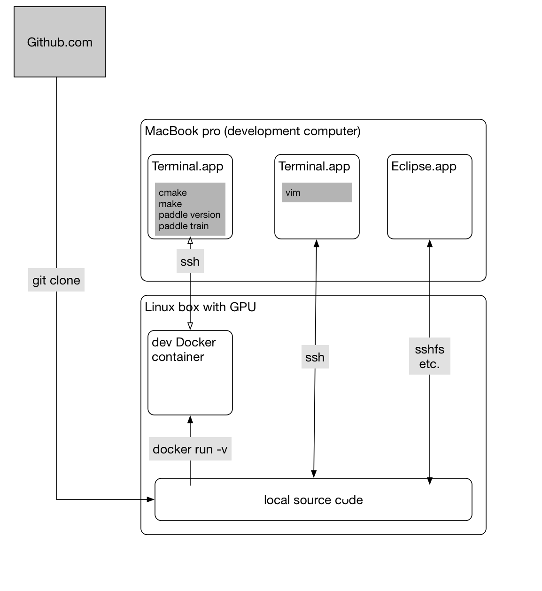

# Building PaddlePaddle

## Goals

We want the building procedure generates Docker images so that we can run PaddlePaddle applications on Kubernetes clusters.

We want to build .deb packages so that enterprise users can run PaddlePaddle applications without Docker.

We want to minimize the size of generated Docker images and .deb packages so to reduce the download time.

We want to encapsulate building tools and dependencies in a *development* Docker image so to ease the tools installation for developers.

Developers use various editors (emacs, vim, Eclipse, Jupyter Notebook), so the development Docker image contains only building tools, not editing tools, and developers are supposed to git clone source code into their development computers and map the code into the development container.

We want the procedure and tools also work with testing, continuous integration, and releasing.


## Docker Images

So we need two Docker images for each version of PaddlePaddle:

1. `paddle:<version>-dev`

   This a development image contains only the development tools and standardizes the building procedure.  Users include:

   - developers -- no longer need to install development tools on the host, and can build their current work on the host (development computer).
   - release engineers -- use this to build the official release from certain branch/tag on Github.com.
   - document writers / Website developers -- Our documents are in the source repo in the form of .md/.rst files and comments in source code.  We need tools to extract the information, typeset, and generate Web pages.

   Of course, developers can install building tools on their development computers.  But different versions of PaddlePaddle might require different set or version of building tools.  Also, it makes collaborative debugging easier if all developers use a unified development environment.

  The development image should include the following tools:

   - gcc/clang
   - nvcc
   - Python
   - sphinx
   - woboq
   - sshd

   Many developers work on a remote computer with GPU; they could ssh into the computer and  `docker exec` into the development container. However, running `sshd` in the container allows developers to ssh into the container directly.

1. `paddle:<version>`

   This is the production image, generated using the development image. This image might have multiple variants:

   - GPU/AVX   `paddle:<version>-gpu`
   - GPU/no-AVX  `paddle:<version>-gpu-noavx`
   - no-GPU/AVX  `paddle:<version>`
   - no-GPU/no-AVX  `paddle:<version>-noavx`

   We allow users to choose between GPU and no-GPU because the GPU version image is much larger than then the no-GPU version.

   We allow users the choice between AVX and no-AVX, because some cloud providers don't provide AVX-enabled VMs.


## Development Environment

Here we describe how to use above two images.  We start from considering our daily development environment.

Developers work on a computer, which is usually a laptop or desktop:



or, they might rely on a more sophisticated box (like with GPUs):



A principle here is that source code lies on the development computer (host) so that editors like Eclipse can parse the source code to support auto-completion.


## Usages

### Build the Development Docker Image

The following commands check out the source code to the host and build the development image `paddle:dev`:

```bash
git clone https://github.com/PaddlePaddle/Paddle paddle
cd paddle
docker build -t paddle:dev .
```

The `docker build` command assumes that `Dockerfile` is in the root source tree.  Note that in this design, this `Dockerfile` is this only one in our repo.

Users can specify a Ubuntu mirror server for faster downloading:

```bash
docker build -t paddle:dev --build-arg UBUNTU_MIRROR=mirror://mirrors.ubuntu.com/mirrors.txt .
```

### Build PaddlePaddle from Source Code

Given the development image `paddle:dev`, the following command builds PaddlePaddle from the source tree on the development computer (host):

```bash
docker run --rm -v $PWD:/paddle -e "WITH_GPU=OFF" -e "WITH_AVX=ON" -e "WITH_TESTING=OFF" -e "RUN_TEST=OFF" paddle:dev
```

This command mounts the source directory on the host into `/paddle` in the container, so the default entry point of `paddle:dev`, `build.sh`, could build the source code with possible local changes.  When it writes to `/paddle/build` in the container, it writes to `$PWD/build` on the host indeed.

`build.sh` builds the following:

- PaddlePaddle binaries,
- `$PWD/build/paddle-<version>.deb` for production installation, and
- `$PWD/build/Dockerfile`, which builds the production Docker image.

Users can specify the following Docker build arguments with either "ON" or "OFF" value:
- `WITH_GPU`: ***Required***. Generates NVIDIA CUDA GPU code and relies on CUDA libraries.
- `WITH_AVX`: ***Required***. Set to "OFF" prevents from generating AVX instructions. If you don't know what is AVX, you might want to set "ON".
- `WITH_TEST`: ***Optional, default OFF***. Build unit tests binaries. Once you've built the unit tests, you can run these test manually by the following command:
  ```bash
    docker run --rm -v $PWD:/paddle -e "WITH_GPU=OFF" -e "WITH_AVX=ON" paddle:dev sh -c "cd /paddle/build; make coverall"
  ```
- `RUN_TEST`: ***Optional, default OFF***. Run unit tests after building. You can't run unit tests without building it.

### Build the Production Docker Image

The following command builds the production image:

```bash
docker build -t paddle -f build/Dockerfile ./build
```

This production image is minimal -- it includes binary `paddle`, the shared library `libpaddle.so`, and Python runtime.

### Run PaddlePaddle Applications

Again the development happens on the host.  Suppose that we have a simple application program in `a.py`, we can test and run it using the production image:

```bash
docker run --rm -it -v $PWD:/work paddle /work/a.py
```

But this works only if all dependencies of `a.py` are in the production image. If this is not the case, we need to build a new Docker image from the production image and with more dependencies installs.

### Build and Run PaddlePaddle Applications

We need a Dockerfile in https://github.com/paddlepaddle/book that builds Docker image `paddlepaddle/book:<version>`, basing on the PaddlePaddle production image:

```
FROM paddlepaddle/paddle:<version>
RUN pip install -U matplotlib jupyter ...
COPY . /book
EXPOSE 8080
CMD ["jupyter"]
```

The book image is an example of PaddlePaddle application image.  We can build it

```bash
git clone https://github.com/paddlepaddle/book
cd book
docker build -t book .
```

### Build and Run Distributed Applications

In our [API design doc](https://github.com/PaddlePaddle/Paddle/blob/develop/doc/design/api.md#distributed-training), we proposed an API that starts a distributed training job on a cluster.  This API need to build a PaddlePaddle application into a Docker image as above and calls kubectl to run it on the cluster.  This API might need to generate a Dockerfile look like above and call `docker build`.

Of course, we can manually build an application image and launch the job using the kubectl tool:

```bash
docker build -f some/Dockerfile -t myapp .
docker tag myapp me/myapp
docker push
kubectl ...
```

### Reading source code with woboq codebrowser
For developers who are interested in the C++ source code, please use -e "WOBOQ=ON" to enable the building of C++ source code into HTML pages using [Woboq codebrowser](https://github.com/woboq/woboq_codebrowser).

- The following command builds PaddlePaddle, generates HTML pages from C++ source code, and writes HTML pages into `$HOME/woboq_out` on the host:

```bash
docker run -v $PWD:/paddle -v $HOME/woboq_out:/woboq_out -e "WITH_GPU=OFF" -e "WITH_AVX=ON" -e "WITH_TEST=ON" -e "WOBOQ=ON" paddle:dev
```

- You can open the generated HTML files in your Web browser. Or, if you want to run a Nginx container to serve them for a wider audience, you can run:

```
docker run -v $HOME/woboq_out:/usr/share/nginx/html -d -p 8080:80 nginx
```
