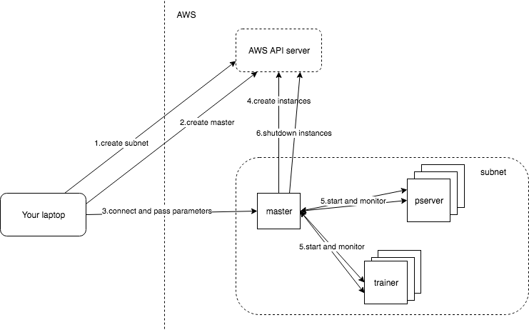

# AWS benchmark testing tool
This is an automation tool for deploying paddlepaddle benchmark testing to AWS.

## Features

 - subnet creation to fit just the amount of ec2 instances required.
 - pserver and trainer ec2 instances allocation, and instance state verification
 - nvidia-docker ready for GPU training
 - Instances and network element garbage collection when a task is accomplished or an error occurred
 - Test log is collected in realtime
 - Web service for checking log or tearing down the testing setup
 - No testing code change needed
 - Lots of optional configuration options

 ## Usages

 ### Prerequisites

 - You have a working AWS account
 - You have [AWS Command Line Interface](https://aws.amazon.com/cli/) installed
 - Your AWS cli is bind with a account which has `AmazonEC2FullAccess` permission, and it's set as default credential.
 - You have key pair created and pem file downloaded.
 - You have a default VPC in the region you want to run the test.
 - You have a Security Group created for the VPC mentioned above, which allows port 22 and the port you want to expose your control web service (5436 by default)
 - If your test is supposed to run in a GPU machine, especially a multi card GPU machine (p2, p3 series), you might need to contact amazon to raise the limit which allows no more than 1 GPU instance at a time.

 ### Start a benchmark test

#### Create training image

*What to expect in this step:*

*You will have your training logic packed with paddle runtime in a docker image, and be able to be picked up by AWS instance for training.*

Training python script and PaddlePaddle runtime are supposed to be packed into one docker image. Use PaddlePaddle production images as base image and create the training images with the docker file as follows:

```Dockerfile
FROM paddlepaddle/paddle:latest-gpu

ENV HOME /root
COPY ./ /root/
WORKDIR /root
RUN pip install -r /root/requirements.txt
ENTRYPOINT ["python", "my_training.py"]
```

***Please Note***
Training nodes will run your `ENTRYPOINT` script with the following environment variables:

 - `TASK_NAME`: unique name to identify this training process.
 - `TRAINING_ROLE`: current node's role in this training process, either "PSERVER" or "TRAINER"
 - `PSERVER_HOSTS`: comma separated value of pserver end points, I.E. "192.168.1.2:5436,192.168.1.3:5436"
 - `PSERVERS`: same as above
 - `TRAINERS`: trainer count
 - `SERVER_ENDPOINT`: current server end point if the node role is a pserver
 - `TRAINER_INDEX`: an integer to identify the index of current trainer if the node role is a trainer.
 - `PADDLE_INIT_TRAINER_ID`: same as above

 Now we have a working distributed training script which takes advantage of node environment variables and docker file to generate the training image. Run the following command:

 ```bash
 docker build -t myreponname/paddle_benchmark .
 ```

 Now you have the image built and tagged with `myreponame/paddle_benchmark`, let's push it to dockerhub so that it can be picked up by out AWS instance.

 ```bash
 docker push myreponame/paddle_benchmark
 ```

#### Create instances and start training

*What to expect in this step*

*you will be asked to provide some basic settings to config your training, and this tool will have your training started and monitored*

Now let's start the training process:

```bash
docker run -i -v $HOME/.aws:/root/.aws -v <full path to your pem file>:/root/<key pair name>.pem \
putcn/paddle_aws_client \
--action create \
--key_name <your key pair name> \
--security_group_id <your security group id> \
--docker_image myreponame/paddle_benchmark \
--pserver_count 2 \
--trainer_count 2 \
--trainer_command batch_size:20,local:no,device:CPU
```

Now just wait until you see this:
```
master server finished init process, visit http://XXX:XXX/status to check master log
```
That means you can turn off your laptop and your cluster is creating instances, starting training process, collecting logs and eventually shut all pservers and trainers down when training is finished.

#### Post creation operations

To access the master log:

```bash
docker run -i -v $HOME/.aws:/root/.aws \
putcn/paddle_aws_client \
--action status \
--master_server_public_ip <master ip> \
--master_server_port <master port>
```

To tear down the training setup:

```bash
docker run -i -v $HOME/.aws:/root/.aws \
putcn/paddle_aws_client \
--action cleanup \
--master_server_public_ip <master ip> \
--master_server_port <master port>
```

To retrieve training logs
TBD

### Tech details

*What to expect in this step*

*You will understand what is happening behind the scene, and how to check the training log, how to tear down the training on the fly, etc.*

Let's understand what is happening under the hood when you run above command in your laptop



There are 4 roles in the figure above:
 - client: your laptop
 - master: who tasks to aws api server to create/tear down instances, and monitor training process
 - AWS api server: the one who actually creates and manages instances
 - pservers and trainers: training instances

When you run the `docker run` command above, what it actually does is to ask aws api service to create a subnet (step 1) and a master instance (step 2), and pass all the parameters the client collected or generated (step 3). The master is kept as minimum hardware config to keep the running cost low.

Then when the master is up and running, it will ask the aws api server to create the heavy lifting training instances who are expensive to run (step 4). And the master will start training process as soon as they are done initializing (step 5).

Meanwhile, the master will expose a web service for client to check training log or even tear the training setup down by a web service call.

if you are creating the training with client docker container, and also monitoring your aws dashboard, you will initially see a instance tagged with `ROLE=MASTER` and `TASK_NAME=<yourtask name>_master` starts, then you will see several instances tagged with `ROLE=PSERVER` and `ROLE=TRAINER` starts.
When the training is finished, pservers and trainers will be terminated. All their logs are kept in master node's docker env.

Master exposes 4 major services:

 - GET `/status`: return master log
 - GET `/logs`: return list of log file names
 - GET `/log/<logfile name>`: return a particular log by log file name
 - POST `/cleanup`: teardown the whole setup


### Parameters

 - key_name: required, aws key pair name
 - security_group_id: required, the security group id associated with your VPC
 - vpc_id: The VPC in which you wish to run test, if not provided, this tool will use your default VPC.
 - subnet_id: The Subnet_id in which you wish to run test, if not provided, this tool will create a new sub net to run test.
 - pserver_instance_type: your pserver instance type, c5.2xlarge by default, which is a memory optimized machine.
 - trainer_instance_type: your trainer instance type, p2.8xlarge by default, which is a GPU machine with 8 cards.
 - task_name: the name you want to identify your job, if not provided, this tool will generate one for you.
 - pserver_image_id: ami id for system image. Please note, although the default one has nvidia-docker installed, pserver is always launched with `docker` instead of `nvidia-docker`, please DO NOT init your training program with GPU place.
 - pserver_command: pserver start command, format example: python,vgg.py,batch_size:128,is_local:no, which will be translated as `python vgg.py --batch_size 128 --is_local no` when trying to start the training in pserver. "--device CPU" is passed as default.
 - trainer_image_id: ami id for system image, default one has nvidia-docker ready.
 - trainer_command: trainer start command. Format is the same as pserver's, "--device GPU" is passed as default.
 - availability_zone: aws zone id to place ec2 instances, us-east-2a by default.
 - trainer_count: Trainer count, 1 by default.
 - pserver_count: Pserver count, 1 by default.
 - action: create|cleanup|status, "create" by default.
 - pserver_port: the port for pserver to open service, 5436 by default.
 - docker_image: the training docker image id.
 - master_service_port: the port for master to open service, 5436 by default.
 - master_server_public_ip: the master service ip, this is required when action is not "create"
 - master_docker_image: master's docker image id, "putcn/paddle_aws_master:latest" by default
 - no_clean_up: no instance termination when training is finished or failed when this value is set "yes". This is for debug purpose, so that you can inspect into the instances when the process is finished. 
 

### Trouble shooting

 1. How to check logs

    Master log is served at `http://<masterip>:<masterport>/status`, and you can list all the log files from `http://<masterip>:<masterport>/logs`, and access either one of them by `http://<masterip>:<masterport>/log/<logfilename>`
